``` r
library(circlize)
```

    ## Warning: package 'circlize' was built under R version 4.1.2

    ## ========================================
    ## circlize version 0.4.15
    ## CRAN page: https://cran.r-project.org/package=circlize
    ## Github page: https://github.com/jokergoo/circlize
    ## Documentation: https://jokergoo.github.io/circlize_book/book/
    ## 
    ## If you use it in published research, please cite:
    ## Gu, Z. circlize implements and enhances circular visualization
    ##   in R. Bioinformatics 2014.
    ## 
    ## This message can be suppressed by:
    ##   suppressPackageStartupMessages(library(circlize))
    ## ========================================

``` r
library(e1071)
```

    ## Warning: package 'e1071' was built under R version 4.1.2

``` r
library(ComplexHeatmap)
```

    ## Loading required package: grid

    ## ========================================
    ## ComplexHeatmap version 2.9.3
    ## Bioconductor page: http://bioconductor.org/packages/ComplexHeatmap/
    ## Github page: https://github.com/jokergoo/ComplexHeatmap
    ## Documentation: http://jokergoo.github.io/ComplexHeatmap-reference
    ## 
    ## If you use it in published research, please cite:
    ## Gu, Z. Complex heatmaps reveal patterns and correlations in multidimensional 
    ##   genomic data. Bioinformatics 2016.
    ## 
    ## The new InteractiveComplexHeatmap package can directly export static 
    ## complex heatmaps into an interactive Shiny app with zero effort. Have a try!
    ## 
    ## This message can be suppressed by:
    ##   suppressPackageStartupMessages(library(ComplexHeatmap))
    ## ========================================

``` r
library(readxl)
```

    ## Warning: package 'readxl' was built under R version 4.1.2

``` r
library(readr)
```

    ## Warning: package 'readr' was built under R version 4.1.2

``` r
library(dplyr)
```

    ## Warning: package 'dplyr' was built under R version 4.1.2

    ## 
    ## Attaching package: 'dplyr'

    ## The following objects are masked from 'package:stats':
    ## 
    ##     filter, lag

    ## The following objects are masked from 'package:base':
    ## 
    ##     intersect, setdiff, setequal, union

``` r
library(survival)
```

    ## Warning: package 'survival' was built under R version 4.1.2

``` r
library(survminer)
```

    ## Loading required package: ggplot2

    ## Warning: package 'ggplot2' was built under R version 4.1.2

    ## Loading required package: ggpubr

    ## Warning: package 'ggpubr' was built under R version 4.1.2

    ## 
    ## Attaching package: 'survminer'

    ## The following object is masked from 'package:survival':
    ## 
    ##     myeloma

``` r
library(ggplot2)
library(GGally)
```

    ## Registered S3 method overwritten by 'GGally':
    ##   method from   
    ##   +.gg   ggplot2

``` r
library(data.table)
```

    ## Warning: package 'data.table' was built under R version 4.1.2

    ## 
    ## Attaching package: 'data.table'

    ## The following objects are masked from 'package:dplyr':
    ## 
    ##     between, first, last

``` r
library(factoextra)
```

    ## Welcome! Want to learn more? See two factoextra-related books at https://goo.gl/ve3WBa

``` r
library(readr)
library(readxl)
library(cluster)
```

    ## Warning: package 'cluster' was built under R version 4.1.2

``` r
library(rstatix)
```

    ## Warning: package 'rstatix' was built under R version 4.1.2

    ## 
    ## Attaching package: 'rstatix'

    ## The following object is masked from 'package:stats':
    ## 
    ##     filter

``` r
library(matrixStats)
```

    ## Warning: package 'matrixStats' was built under R version 4.1.2

    ## 
    ## Attaching package: 'matrixStats'

    ## The following object is masked from 'package:dplyr':
    ## 
    ##     count

``` r
library(factoextra)
library(ggalluvial)
```

    ## Warning: package 'ggalluvial' was built under R version 4.1.2

``` r
library(dplyr)
library(tidyr)
```

    ## Warning: package 'tidyr' was built under R version 4.1.2

``` r
library(stringr)
```

    ## Warning: package 'stringr' was built under R version 4.1.2

``` r
library(purrr)
```

    ## Warning: package 'purrr' was built under R version 4.1.2

    ## 
    ## Attaching package: 'purrr'

    ## The following object is masked from 'package:data.table':
    ## 
    ##     transpose

``` r
library(gt)
```

    ## Warning: package 'gt' was built under R version 4.1.2

``` r
library(ConsensusClusterPlus)
library(klaR)
```

    ## Warning: package 'klaR' was built under R version 4.1.2

    ## Loading required package: MASS

    ## Warning: package 'MASS' was built under R version 4.1.2

    ## 
    ## Attaching package: 'MASS'

    ## The following object is masked from 'package:rstatix':
    ## 
    ##     select

    ## The following object is masked from 'package:dplyr':
    ## 
    ##     select

``` r
#reading in the metastatic site data
mm <- read_excel("~/Dog/Supplemental Table 1_VCO.xlsx")
```

    ## New names:
    ## • `Site of OSA metastasis` -> `Site of OSA metastasis...16`
    ## • `Site of OSA metastasis` -> `Site of OSA metastasis...17`
    ## • `` -> `...18`
    ## • `Cluster` -> `Cluster...23`
    ## • `Cluster` -> `Cluster...49`

``` r
#remove empty columns
mm$Cluster...23 <- NULL
mm$Cluster...49 <- NULL
mets_map <- (mm[,c(19:44)] == "1")*1
mets_map <- as.matrix(mets_map)
rownames(mets_map) <- mm$`Patient ID`
mets_map[which(is.na(mets_map), arr.ind = T)] = 0
mets_map_updated <- as.data.frame(mets_map)
mets_map_updated <- mets_map_updated[,-which(colnames(mets_map_updated) %in% c("Omentum","Mesentery","Body Wall","Mediastinum","Pleura","Abdominal Mass","Meninges","Caudal Oral Cavity","Subcutaneos Tissue","Bladder"))]
mets_map_updated <- as.matrix(mets_map_updated)
mm2 = mets_map_updated[mets_map_updated[,1] == 0,2:ncol(mets_map_updated)]
```

``` r
#within sum of squares analysis of clusters
set.seed(1234)
#clustering analysis comparison
fun.compute_withinss <- function(model, k = NULL) {
  # Assign samples to clusters
  clusters <- fun.assign_clusters(model = model, k = k)
  
  # Compute averages per cluster center
  centers <- clusters %>% 
    group_by(cluster) %>% 
    summarize_all(mean) %>% 
    pivot_longer(cols = -cluster, names_to = "question", values_to = "cluster_mean")
  
  # Compute sum of squared differences from cluster centers
  out <- clusters %>% 
    pivot_longer(cols = -cluster, names_to = "question", values_to = "response") %>% 
    left_join(centers, by = c("cluster", "question")) %>% 
    summarize(k = max(cluster),
              withinss = sum((response - cluster_mean)^2)) %>% 
    mutate(model = class(model)[1])
  
  return(out)
}

fun.assign_clusters <- function(model, k = NULL) {
  if (class(model)[1] %in% c("kmodes")) {
    cluster_assignment <- model$cluster
  }
  if (class(model)[1] %in% c("agnes", "diana")) {
    if (is.null(k)) {
      stop("k required for hierarchical models!")
    }
    cluster_assignment <- stats::cutree(model, k = k)
  }
  
  clusters <- as.data.frame(mm2) %>% 
    mutate(cluster = cluster_assignment)
  
  return(clusters)
}


#compute Jaccard distance matrix
mat.dissimiarity <- stats::dist(mm2, method = "binary")

#cluster using AGNES
lst.agnes <- cluster::agnes(mat.dissimiarity, diss = TRUE, keep.diss = TRUE, method = "complete")
tbl.agnes_withindiss <- 1:6 %>% 
  map(~fun.compute_withinss(lst.agnes, .))
tbl.agnes_withindiss <- Reduce(rbind, tbl.agnes_withindiss)  %>% 
  mutate(withindiss = withinss)

#cluster using DIANA
lst.diana <- cluster::diana(mat.dissimiarity, diss = TRUE, keep.diss = TRUE)
tbl.diana_withindiss <-  1:6 %>% 
  map(~fun.compute_withinss(lst.diana, .))
tbl.diana_withindiss <- Reduce(rbind, tbl.diana_withindiss) %>%
  mutate(withindiss = withinss)

#cluster using Kmodes
lst.kmodes <- tibble(k = 1:6) %>%
  mutate(
    kclust = map(k, ~klaR::kmodes(mm2, modes = ., iter.max = 500))
  )

tbl.kmodes_withindiss <- lst.kmodes$kclust %>% 
  map(fun.compute_withinss)
tbl.kmodes_withindiss <- Reduce(rbind, tbl.kmodes_withindiss) %>% 
  mutate(withindiss = withinss)

fig.dissimilarity <- bind_rows(tbl.kmodes_withindiss,
          tbl.agnes_withindiss, tbl.diana_withindiss)

p1 <- ggplot(data = as.data.frame(fig.dissimilarity), aes(x = k, y = withindiss, color = model, linetype = model)) +
  geom_line() +
  scale_x_continuous(breaks = 1:20) + 
  theme_minimal() +
  labs(x = "Number of Clusters", y = bquote(W[k]), color = "Model", linetype = "Model",
       title = "Within cluster sum of squares")
print(p1)
```

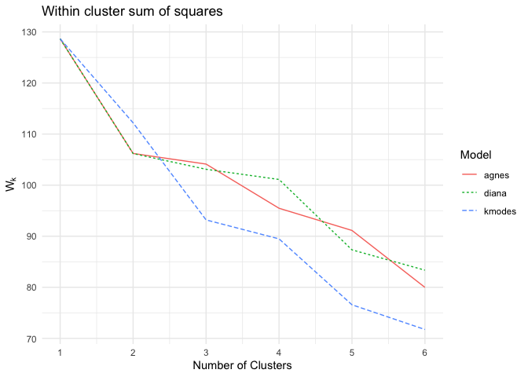

``` r
pdf("~/Dog/Clustering_analysis.pdf")
print(p1)
dev.off()
```

    ## quartz_off_screen 
    ##                 2

``` r
set.seed(2425)
kmodesHook <- function(this_dist,k){
tmp = kmodes(as.matrix(this_dist),modes = k)
assignment = tmp$cluster
return(assignment)
}
distfunc <- function(x){ dist(x,method="binary")}
rcckmodes = ConsensusClusterPlus(t(mm2),maxK=6,reps=100,pItem=0.8,pFeature=1,title="example_kmodes",clusterAlg="kmodesHook", distance="distfunc", verbose = F, plot = "pdf")
```

    ## end fraction

    ## clustered
    ## clustered
    ## clustered
    ## clustered
    ## clustered

``` r
set.seed(2425)
agnesHook <- function(this_dist,k){
 tmp = agnes(this_dist,diss=TRUE, method = "complete")
 assignment = cutree(tmp,k)
 return(assignment)
}
distfunc <- function(x){ dist(x,method="binary")}
rccagnes = ConsensusClusterPlus(t(mm2),maxK=6,reps=100,pItem=0.8,pFeature=1,title="example_agnes",clusterAlg="agnesHook", distance="distfunc", verbose = F, plot = "pdf")
```

    ## end fraction

    ## clustered
    ## clustered
    ## clustered
    ## clustered
    ## clustered

``` r
set.seed(2425)
dianaHook <- function(this_dist,k){
 tmp = diana(this_dist,diss=TRUE)
 assignment = cutree(tmp,k)
 return(assignment)
}
distfunc <- function(x){ dist(x,method="binary")}
rccdiana = ConsensusClusterPlus(t(mm2),maxK=6,reps=100,pItem=0.8,pFeature=1,title="example_diana",clusterAlg="dianaHook", distance="distfunc", verbose = F, plot = "pdf")
```

    ## end fraction

    ## clustered
    ## clustered
    ## clustered
    ## clustered
    ## clustered

``` r
col_fun = colorRamp2(c(0, 1), c("white", "black"))
cluster <- rcckmodes[[2]]$consensusClass
p1 <- Heatmap(mm2, split = as.character(cluster), cluster_columns = T, row_gap = unit(5, "mm"),col = col_fun)
print(p1)
```

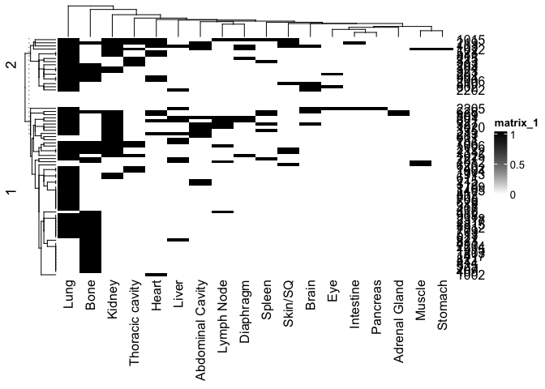

``` r
#pdf(file = "~/Dog/mets_heatmap_kmodes2.pdf",width = 6, height = 10)
#print(p1)
#dev.off()

dd <- data.frame(nmets = rowSums(mm2), cluster = as.character(cluster), stringsAsFactors = F)
p1 <- ggplot(data = dd, aes(x = cluster, y = nmets)) + geom_boxplot() + theme_classic() + theme(text = element_text(size = 15)) + stat_compare_means()
print(p1)
```

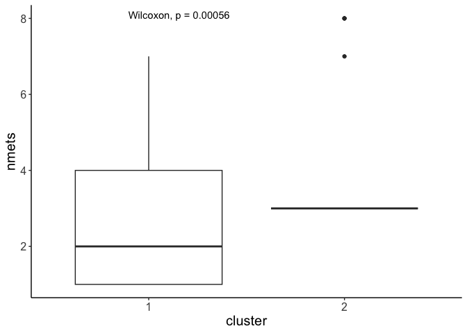

``` r
col_fun = colorRamp2(c(0, 1), c("white", "black"))
cluster <- rccagnes[[2]]$consensusClass
p1 <- Heatmap(mm2, split = as.character(cluster), cluster_columns = T, row_gap = unit(5, "mm"),col = col_fun)
print(p1)
```

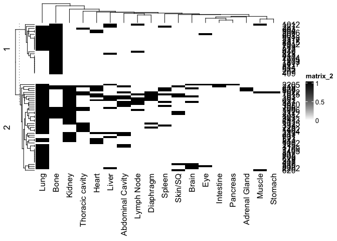

``` r
#pdf(file = "~/Dog/mets_heatmap_agnes2.pdf",width = 6, height = 10)
#print(p1)
#dev.off()
dd <- data.frame(nmets = rowSums(mm2), cluster = as.character(cluster), stringsAsFactors = F)
p1 <- ggplot(data = dd, aes(x = cluster, y = nmets)) + geom_boxplot() + theme_classic() + theme(text = element_text(size = 15)) + stat_compare_means()
print(p1)
```

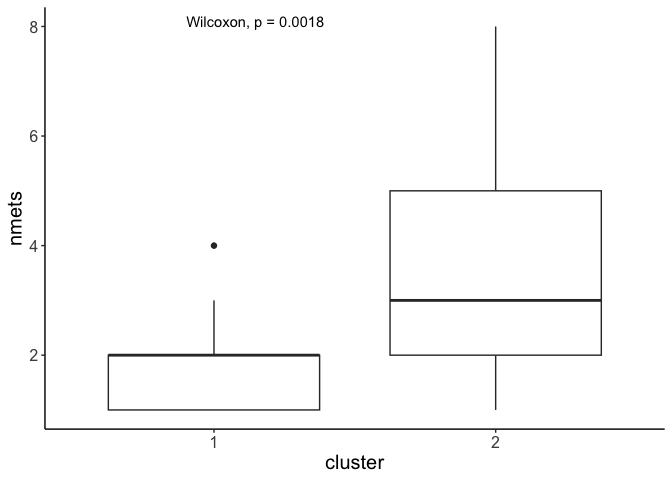

``` r
col_fun = colorRamp2(c(0, 1), c("white", "black"))
cluster <- rccdiana[[2]]$consensusClass
p1 <- Heatmap(mm2, row_split = as.character(cluster), cluster_rows = T, row_gap = unit(5, "mm"),col = col_fun)
print(p1)
```

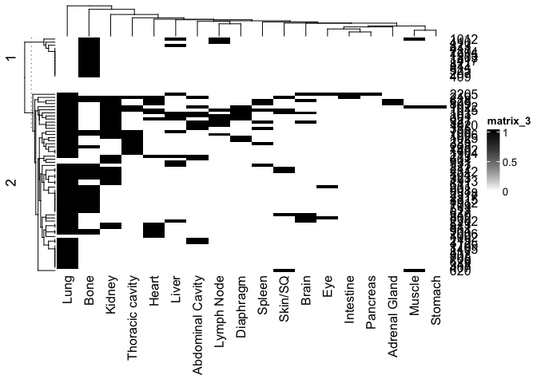

``` r
#pdf(file = "~/Dog/mets_heatmap_diana2.pdf",width = 6, height = 10)
#print(p1)
#dev.off()

dd <- data.frame(nmets = rowSums(mm2), cluster = as.character(cluster), stringsAsFactors = F)
p1 <- ggplot(data = dd, aes(x = cluster, y = nmets)) + geom_boxplot() + theme_classic() + theme(text = element_text(size = 15)) + stat_compare_means()
print(p1)
```

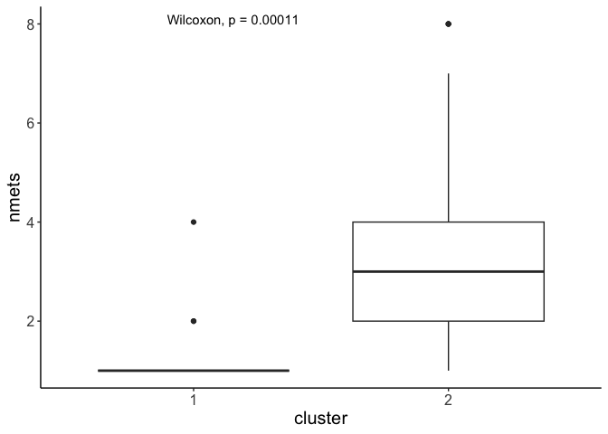

``` r
#Scripts to read in the canine OS clinical metadata

#clinical metadata for all cases that received Rapamycin (mTOR inhibitor) in addition to standard of care therapy
Slides2Outcomes_Rapa_all <- read_csv("~/Dog/Slides2Outcomes_Rapa_all_new.csv")
```

    ## New names:
    ## Rows: 295 Columns: 24
    ## ── Column specification
    ## ──────────────────────────────────────────────────────── Delimiter: "," chr
    ## (15): Study, Site, Name, breed, gender, Tumor Location, PH vs NPH, ALP, ... dbl
    ## (9): ...1, Patient ID, age, weight, PH, DFI, DFI_censor, Survival (days...
    ## ℹ Use `spec()` to retrieve the full column specification for this data. ℹ
    ## Specify the column types or set `show_col_types = FALSE` to quiet this message.
    ## • `` -> `...1`

``` r
#clinical metadata for all cases that received standard of care therapy
Slides2Outcomes_SOC_all <- read_csv("~/Dog/Slides2Outcomes_SOC_all_new.csv")
```

    ## New names:
    ## Rows: 305 Columns: 24
    ## ── Column specification
    ## ──────────────────────────────────────────────────────── Delimiter: "," chr
    ## (15): Study, Site, Name, breed, gender, Tumor Location, PH vs NPH, ALP, ... dbl
    ## (9): ...1, Patient ID, age, weight, PH, DFI, DFI_censor, Survival (days...
    ## ℹ Use `spec()` to retrieve the full column specification for this data. ℹ
    ## Specify the column types or set `show_col_types = FALSE` to quiet this message.
    ## • `` -> `...1`

``` r
dat1 <- subset(Slides2Outcomes_Rapa_all,select = c("slide","Patient ID","Tumor Location","Site","age","weight","breed","gender","PH","ALP","Group","DFI","DFI_censor","Survival (days from sx)","Surv_censor"))
dat1$treatment = rep("Rapamycin", nrow(dat1))

dat2 <- subset(Slides2Outcomes_SOC_all,select = c("slide","Patient ID","Tumor Location","Site","age","weight","breed","gender","PH","ALP","Group","DFI","DFI_censor","Survival (days from sx)","Surv_censor"))
dat2$treatment = rep("SOC", nrow(dat2))

clindat_all <- rbind(dat1,dat2)
clindat_all <- as.data.frame(clindat_all)
clindat_all <- clindat_all[!duplicated(clindat_all$slide),]
rownames(clindat_all) <- substr(clindat_all$slide,1,19)
clindat_all <- clindat_all[,-1]
colnames(clindat_all)[c(11,12,13,14)] <- c("DFS_time","DFS_status","OS_time","OS_status")
clindat_all$ALP[clindat_all$ALP == "elevated"] <- "Elevated"
clindat_all$gender[clindat_all$`Patient ID` == "307"] <- "Spayed Female"
clindat_all$gender[grepl("Castrated",clindat_all$gender)] <- "Castrated Male"
clindat_all$gender[grepl("Spayed",clindat_all$gender)] <- "Spayed Female"
clindat_all$gender[grepl("Male Phenotype",clindat_all$gender)] <- "Intact Male"
clindat_all$gender[grepl("Female Phenotype",clindat_all$gender)] <- "Intact Female"
clindat_all <- clindat_all[!duplicated(clindat_all$`Patient ID`),]
c1 <- clindat_all
rownames(c1) <- c1$`Patient ID`


c1 = c1[rownames(mets_map_updated),]
met_grp <- rep("no mets", 83)
met_grp[mets_map_updated[,1] == 0] <- as.character(cluster)
c1$mets_grp <- met_grp

#Perform Kaplan Meier analysis
surv <- survfit(Surv(OS_time, OS_status) ~ mets_grp, data = c1[c1$mets_grp != "no mets",])
diff <- survdiff(Surv(OS_time, OS_status) ~ mets_grp, data = c1[c1$mets_grp != "no mets",])

p1 <- ggsurvplot(surv, data = c1[c1$mets_grp != "no mets",],
                  
                  legend.title = "Dog osteosarcoma overall survival (N = 71)",
                  legend = "top",
                  conf.int = T,
                  pval = TRUE,
                  risk.table = TRUE,
                  tables.height = 0.2,
                  tables.theme = theme_cleantable(),
                  risk.table.y.text = FALSE,
                 pval.coord = c(0, 0.03),
                  # Color palettes. Use custom color: c("#E7B800", "#2E9FDF"),
                  # or brewer color (e.g.: "Dark2"), or ggsci color (e.g.: "jco")
                  ggtheme = theme(text = element_text(size = 15)) + theme_bw() # Change ggplot2 theme
) + xlab("Time (days from sx)")
print(p1)
```

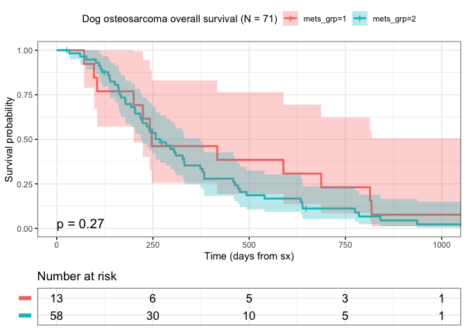

``` r
print(surv_median(surv))
```

    ## Warning: `select_()` was deprecated in dplyr 0.7.0.
    ## ℹ Please use `select()` instead.
    ## ℹ The deprecated feature was likely used in the survminer package.
    ##   Please report the issue at <https://github.com/kassambara/survminer/issues>.
    ## This warning is displayed once every 8 hours.
    ## Call `lifecycle::last_lifecycle_warnings()` to see where this warning was
    ## generated.

    ##       strata median lower upper
    ## 1 mets_grp=1    247   200    NA
    ## 2 mets_grp=2    269   219   373

``` r
surv <- survfit(Surv(DFS_time, DFS_status) ~ mets_grp, data = c1[c1$mets_grp != "no mets",])
diff <- survdiff(Surv(DFS_time, DFS_status) ~ mets_grp, data = c1[c1$mets_grp != "no mets",])

p2 <- ggsurvplot(surv, data = c1[c1$mets_grp != "no mets",],
                  legend.title = "Dog osteosarcoma DFI (N = 71)",
                 legend = "top",
                  conf.int = T,
                  pval = TRUE,
                  risk.table = TRUE,
                  tables.height = 0.2,
                  tables.theme = theme_cleantable(),
                  risk.table.y.text = FALSE,
                 pval.coord = c(0, 0.03),
                  # Color palettes. Use custom color: c("#E7B800", "#2E9FDF"),
                  # or brewer color (e.g.: "Dark2"), or ggsci color (e.g.: "jco")
                  ggtheme = theme(text = element_text(size = 15)) + theme_bw() # Change ggplot2 theme
)
print(p2)
```

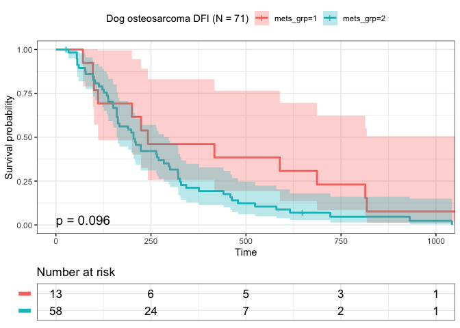

``` r
survfig <- ggarrange(p1[[1]],p2[[1]],p1[[2]],p2[[2]], labels = c("A","B","",""), ncol = 2, nrow = 2, heights = c(3,1))
print(survfig)
```

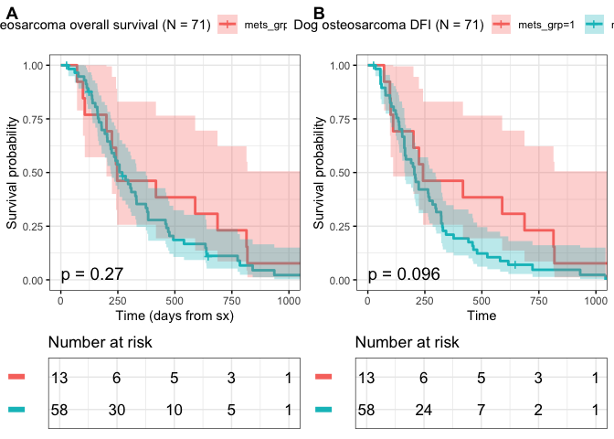

``` r
pdf("~/Dog/vco_metsites_survival_fig.pdf", width = 7, height = 4)
print(survfig)
dev.off()
```

    ## quartz_off_screen 
    ##                 2

#Univariate correlation analysis of metastatic outgrowth patterns with
site of enrollment

``` r
library(mmtable2)
```

    ## 
    ## Attaching package: 'mmtable2'

    ## The following object is masked from 'package:tidyr':
    ## 
    ##     table1

``` r
mm$Cluster <- met_grp
mm$Cluster[mm$Cluster == "no mets"] <- "no known mets"
him_dat <- melt(table(data.frame(Site = mm$Site, mets_grp = mm$Cluster)))
```

    ## Warning in melt(table(data.frame(Site = mm$Site, mets_grp = mm$Cluster))): The
    ## melt generic in data.table has been passed a table and will attempt to redirect
    ## to the relevant reshape2 method; please note that reshape2 is deprecated, and
    ## this redirection is now deprecated as well. To continue using melt methods from
    ## reshape2 while both libraries are attached, e.g. melt.list, you can prepend the
    ## namespace like reshape2::melt(table(data.frame(Site = mm$Site, mets_grp =
    ## mm$Cluster))). In the next version, this warning will become an error.

``` r
pp <-ggplot(data = him_dat,
       aes(axis1 = Site, axis2 = mets_grp, y = value)) +
  geom_alluvium(aes(fill = mets_grp)) +
  geom_stratum() +
  geom_text(stat = "stratum",
            aes(label = after_stat(stratum))) +
  theme_void()

print(pp)
```

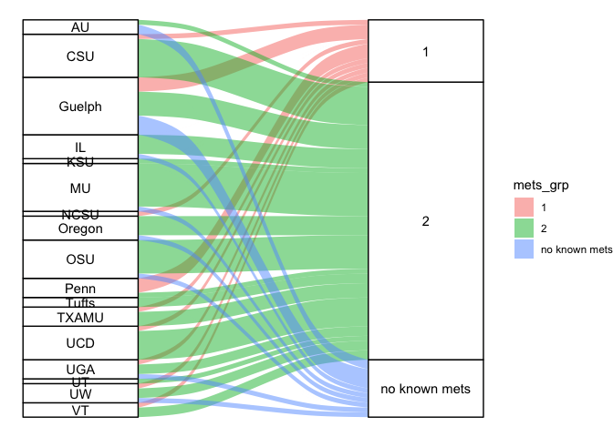

``` r
print(t(table(data.frame(Site = mm$Site, mets_grp = mm$Cluster))))
```

    ##                Site
    ## mets_grp        AU CSU Guelph IL KSU MU NCSU Oregon OSU Penn Tufts TXAMU UCD
    ##   1              0   1      3  0   0  0    1      0   0    3     0     1   1
    ##   2              1   8      5  4   1  9    0      4   7    1     2     3   6
    ##   no known mets  2   0      4  1   0  1    0      1   1    0     0     0   0
    ##                Site
    ## mets_grp        UGA UT UW VT
    ##   1               1  0  1  1
    ##   2               2  1  2  2
    ##   no known mets   1  0  1  0

``` r
print(chisq.test(table(data.frame(Site = mm$Site, mets_grp = mm$Cluster))))
```

    ## Warning in chisq.test(table(data.frame(Site = mm$Site, mets_grp =
    ## mm$Cluster))): Chi-squared approximation may be incorrect

    ## 
    ##  Pearson's Chi-squared test
    ## 
    ## data:  table(data.frame(Site = mm$Site, mets_grp = mm$Cluster))
    ## X-squared = 41.883, df = 32, p-value = 0.1134

``` r
style_list <- list(cell_borders(sides = "top",color = "grey"))
gm_table <- 
 him_dat %>% 
  mmtable(cells = value) +
  header_left(mets_grp) +
  header_top(Site) +
  header_format(Site, scope = "table", style = style_list)
```

    ## Warning: Since gt v0.9.0, the `colors` argument has been deprecated.
    ## • Please use the `palette` argument to define a color palette.
    ## This warning is displayed once every 8 hours.

``` r
print(gm_table)
```

<style>#wvaowjjyyf table {
font-family: system-ui, 'Segoe UI', Roboto, Helvetica, Arial, sans-serif, 'Apple Color Emoji', 'Segoe UI Emoji', 'Segoe UI Symbol', 'Noto Color Emoji';
-webkit-font-smoothing: antialiased;
-moz-osx-font-smoothing: grayscale;
}
#wvaowjjyyf thead, #wvaowjjyyf tbody, #wvaowjjyyf tfoot, #wvaowjjyyf tr, #wvaowjjyyf td, #wvaowjjyyf th {
border-style: none;
}
#wvaowjjyyf p {
margin: 0;
padding: 0;
}
#wvaowjjyyf .gt_table {
display: table;
border-collapse: collapse;
line-height: normal;
margin-left: auto;
margin-right: auto;
color: #333333;
font-size: 16px;
font-weight: normal;
font-style: normal;
background-color: #FFFFFF;
width: auto;
border-top-style: solid;
border-top-width: 2px;
border-top-color: #A8A8A8;
border-right-style: none;
border-right-width: 2px;
border-right-color: #D3D3D3;
border-bottom-style: solid;
border-bottom-width: 2px;
border-bottom-color: #A8A8A8;
border-left-style: none;
border-left-width: 2px;
border-left-color: #D3D3D3;
}
#wvaowjjyyf .gt_caption {
padding-top: 4px;
padding-bottom: 4px;
}
#wvaowjjyyf .gt_title {
color: #333333;
font-size: 125%;
font-weight: initial;
padding-top: 4px;
padding-bottom: 4px;
padding-left: 5px;
padding-right: 5px;
border-bottom-color: #FFFFFF;
border-bottom-width: 0;
}
#wvaowjjyyf .gt_subtitle {
color: #333333;
font-size: 85%;
font-weight: initial;
padding-top: 3px;
padding-bottom: 5px;
padding-left: 5px;
padding-right: 5px;
border-top-color: #FFFFFF;
border-top-width: 0;
}
#wvaowjjyyf .gt_heading {
background-color: #FFFFFF;
text-align: center;
border-bottom-color: #FFFFFF;
border-left-style: none;
border-left-width: 1px;
border-left-color: #D3D3D3;
border-right-style: none;
border-right-width: 1px;
border-right-color: #D3D3D3;
}
#wvaowjjyyf .gt_bottom_border {
border-bottom-style: solid;
border-bottom-width: 2px;
border-bottom-color: #D3D3D3;
}
#wvaowjjyyf .gt_col_headings {
border-top-style: solid;
border-top-width: 2px;
border-top-color: #D3D3D3;
border-bottom-style: solid;
border-bottom-width: 2px;
border-bottom-color: #D3D3D3;
border-left-style: none;
border-left-width: 1px;
border-left-color: #D3D3D3;
border-right-style: none;
border-right-width: 1px;
border-right-color: #D3D3D3;
}
#wvaowjjyyf .gt_col_heading {
color: #333333;
background-color: #FFFFFF;
font-size: 100%;
font-weight: normal;
text-transform: inherit;
border-left-style: none;
border-left-width: 1px;
border-left-color: #D3D3D3;
border-right-style: none;
border-right-width: 1px;
border-right-color: #D3D3D3;
vertical-align: bottom;
padding-top: 5px;
padding-bottom: 6px;
padding-left: 5px;
padding-right: 5px;
overflow-x: hidden;
}
#wvaowjjyyf .gt_column_spanner_outer {
color: #333333;
background-color: #FFFFFF;
font-size: 100%;
font-weight: normal;
text-transform: inherit;
padding-top: 0;
padding-bottom: 0;
padding-left: 4px;
padding-right: 4px;
}
#wvaowjjyyf .gt_column_spanner_outer:first-child {
padding-left: 0;
}
#wvaowjjyyf .gt_column_spanner_outer:last-child {
padding-right: 0;
}
#wvaowjjyyf .gt_column_spanner {
border-bottom-style: solid;
border-bottom-width: 2px;
border-bottom-color: #D3D3D3;
vertical-align: bottom;
padding-top: 5px;
padding-bottom: 5px;
overflow-x: hidden;
display: inline-block;
width: 100%;
}
#wvaowjjyyf .gt_spanner_row {
border-bottom-style: hidden;
}
#wvaowjjyyf .gt_group_heading {
padding-top: 8px;
padding-bottom: 8px;
padding-left: 5px;
padding-right: 5px;
color: #333333;
background-color: #FFFFFF;
font-size: 100%;
font-weight: initial;
text-transform: inherit;
border-top-style: solid;
border-top-width: 2px;
border-top-color: #D3D3D3;
border-bottom-style: solid;
border-bottom-width: 2px;
border-bottom-color: #D3D3D3;
border-left-style: none;
border-left-width: 1px;
border-left-color: #D3D3D3;
border-right-style: none;
border-right-width: 1px;
border-right-color: #D3D3D3;
vertical-align: middle;
text-align: left;
}
#wvaowjjyyf .gt_empty_group_heading {
padding: 0.5px;
color: #333333;
background-color: #FFFFFF;
font-size: 100%;
font-weight: initial;
border-top-style: solid;
border-top-width: 2px;
border-top-color: #D3D3D3;
border-bottom-style: solid;
border-bottom-width: 2px;
border-bottom-color: #D3D3D3;
vertical-align: middle;
}
#wvaowjjyyf .gt_from_md > :first-child {
margin-top: 0;
}
#wvaowjjyyf .gt_from_md > :last-child {
margin-bottom: 0;
}
#wvaowjjyyf .gt_row {
padding-top: 8px;
padding-bottom: 8px;
padding-left: 5px;
padding-right: 5px;
margin: 10px;
border-top-style: solid;
border-top-width: 1px;
border-top-color: #D3D3D3;
border-left-style: none;
border-left-width: 1px;
border-left-color: #D3D3D3;
border-right-style: none;
border-right-width: 1px;
border-right-color: #D3D3D3;
vertical-align: middle;
overflow-x: hidden;
}
#wvaowjjyyf .gt_stub {
color: #333333;
background-color: #FFFFFF;
font-size: 100%;
font-weight: initial;
text-transform: inherit;
border-right-style: solid;
border-right-width: 2px;
border-right-color: #D3D3D3;
padding-left: 5px;
padding-right: 5px;
}
#wvaowjjyyf .gt_stub_row_group {
color: #333333;
background-color: #FFFFFF;
font-size: 100%;
font-weight: initial;
text-transform: inherit;
border-right-style: solid;
border-right-width: 2px;
border-right-color: #D3D3D3;
padding-left: 5px;
padding-right: 5px;
vertical-align: top;
}
#wvaowjjyyf .gt_row_group_first td {
border-top-width: 2px;
}
#wvaowjjyyf .gt_row_group_first th {
border-top-width: 2px;
}
#wvaowjjyyf .gt_summary_row {
color: #333333;
background-color: #FFFFFF;
text-transform: inherit;
padding-top: 8px;
padding-bottom: 8px;
padding-left: 5px;
padding-right: 5px;
}
#wvaowjjyyf .gt_first_summary_row {
border-top-style: solid;
border-top-color: #D3D3D3;
}
#wvaowjjyyf .gt_first_summary_row.thick {
border-top-width: 2px;
}
#wvaowjjyyf .gt_last_summary_row {
padding-top: 8px;
padding-bottom: 8px;
padding-left: 5px;
padding-right: 5px;
border-bottom-style: solid;
border-bottom-width: 2px;
border-bottom-color: #D3D3D3;
}
#wvaowjjyyf .gt_grand_summary_row {
color: #333333;
background-color: #FFFFFF;
text-transform: inherit;
padding-top: 8px;
padding-bottom: 8px;
padding-left: 5px;
padding-right: 5px;
}
#wvaowjjyyf .gt_first_grand_summary_row {
padding-top: 8px;
padding-bottom: 8px;
padding-left: 5px;
padding-right: 5px;
border-top-style: double;
border-top-width: 6px;
border-top-color: #D3D3D3;
}
#wvaowjjyyf .gt_last_grand_summary_row_top {
padding-top: 8px;
padding-bottom: 8px;
padding-left: 5px;
padding-right: 5px;
border-bottom-style: double;
border-bottom-width: 6px;
border-bottom-color: #D3D3D3;
}
#wvaowjjyyf .gt_striped {
background-color: rgba(128, 128, 128, 0.05);
}
#wvaowjjyyf .gt_table_body {
border-top-style: solid;
border-top-width: 2px;
border-top-color: #D3D3D3;
border-bottom-style: solid;
border-bottom-width: 2px;
border-bottom-color: #D3D3D3;
}
#wvaowjjyyf .gt_footnotes {
color: #333333;
background-color: #FFFFFF;
border-bottom-style: none;
border-bottom-width: 2px;
border-bottom-color: #D3D3D3;
border-left-style: none;
border-left-width: 2px;
border-left-color: #D3D3D3;
border-right-style: none;
border-right-width: 2px;
border-right-color: #D3D3D3;
}
#wvaowjjyyf .gt_footnote {
margin: 0px;
font-size: 90%;
padding-top: 4px;
padding-bottom: 4px;
padding-left: 5px;
padding-right: 5px;
}
#wvaowjjyyf .gt_sourcenotes {
color: #333333;
background-color: #FFFFFF;
border-bottom-style: none;
border-bottom-width: 2px;
border-bottom-color: #D3D3D3;
border-left-style: none;
border-left-width: 2px;
border-left-color: #D3D3D3;
border-right-style: none;
border-right-width: 2px;
border-right-color: #D3D3D3;
}
#wvaowjjyyf .gt_sourcenote {
font-size: 90%;
padding-top: 4px;
padding-bottom: 4px;
padding-left: 5px;
padding-right: 5px;
}
#wvaowjjyyf .gt_left {
text-align: left;
}
#wvaowjjyyf .gt_center {
text-align: center;
}
#wvaowjjyyf .gt_right {
text-align: right;
font-variant-numeric: tabular-nums;
}
#wvaowjjyyf .gt_font_normal {
font-weight: normal;
}
#wvaowjjyyf .gt_font_bold {
font-weight: bold;
}
#wvaowjjyyf .gt_font_italic {
font-style: italic;
}
#wvaowjjyyf .gt_super {
font-size: 65%;
}
#wvaowjjyyf .gt_footnote_marks {
font-size: 75%;
vertical-align: 0.4em;
position: initial;
}
#wvaowjjyyf .gt_asterisk {
font-size: 100%;
vertical-align: 0;
}
#wvaowjjyyf .gt_indent_1 {
text-indent: 5px;
}
#wvaowjjyyf .gt_indent_2 {
text-indent: 10px;
}
#wvaowjjyyf .gt_indent_3 {
text-indent: 15px;
}
#wvaowjjyyf .gt_indent_4 {
text-indent: 20px;
}
#wvaowjjyyf .gt_indent_5 {
text-indent: 25px;
}
</style>
<table class="gt_table" data-quarto-disable-processing="false" data-quarto-bootstrap="false">
<tbody class="gt_table_body">
<tr>
<td headers class="gt_row gt_left" style="background-color: #FFFFFF; color: #000000; font-size: 12px;">
</td>
<td headers class="gt_row gt_left" style="background-color: #FFFFFF; color: #000000; font-size: 12px; text-align: right; font-weight: bold; border-top-width: 1px; border-top-style: solid; border-top-color: grey;">
AU
</td>
<td headers class="gt_row gt_left" style="background-color: #FFFFFF; color: #000000; font-size: 12px; text-align: right; font-weight: bold; border-top-width: 1px; border-top-style: solid; border-top-color: grey;">
CSU
</td>
<td headers class="gt_row gt_left" style="background-color: #FFFFFF; color: #000000; font-size: 12px; text-align: right; font-weight: bold; border-top-width: 1px; border-top-style: solid; border-top-color: grey;">
Guelph
</td>
<td headers class="gt_row gt_left" style="background-color: #FFFFFF; color: #000000; font-size: 12px; text-align: right; font-weight: bold; border-top-width: 1px; border-top-style: solid; border-top-color: grey;">
IL
</td>
<td headers class="gt_row gt_left" style="background-color: #FFFFFF; color: #000000; font-size: 12px; text-align: right; font-weight: bold; border-top-width: 1px; border-top-style: solid; border-top-color: grey;">
KSU
</td>
<td headers class="gt_row gt_left" style="background-color: #FFFFFF; color: #000000; font-size: 12px; text-align: right; font-weight: bold; border-top-width: 1px; border-top-style: solid; border-top-color: grey;">
MU
</td>
<td headers class="gt_row gt_left" style="background-color: #FFFFFF; color: #000000; font-size: 12px; text-align: right; font-weight: bold; border-top-width: 1px; border-top-style: solid; border-top-color: grey;">
NCSU
</td>
<td headers class="gt_row gt_left" style="background-color: #FFFFFF; color: #000000; font-size: 12px; text-align: right; font-weight: bold; border-top-width: 1px; border-top-style: solid; border-top-color: grey;">
Oregon
</td>
<td headers class="gt_row gt_left" style="background-color: #FFFFFF; color: #000000; font-size: 12px; text-align: right; font-weight: bold; border-top-width: 1px; border-top-style: solid; border-top-color: grey;">
OSU
</td>
<td headers class="gt_row gt_left" style="background-color: #FFFFFF; color: #000000; font-size: 12px; text-align: right; font-weight: bold; border-top-width: 1px; border-top-style: solid; border-top-color: grey;">
Penn
</td>
<td headers class="gt_row gt_left" style="background-color: #FFFFFF; color: #000000; font-size: 12px; text-align: right; font-weight: bold; border-top-width: 1px; border-top-style: solid; border-top-color: grey;">
Tufts
</td>
<td headers class="gt_row gt_left" style="background-color: #FFFFFF; color: #000000; font-size: 12px; text-align: right; font-weight: bold; border-top-width: 1px; border-top-style: solid; border-top-color: grey;">
TXAMU
</td>
<td headers class="gt_row gt_left" style="background-color: #FFFFFF; color: #000000; font-size: 12px; text-align: right; font-weight: bold; border-top-width: 1px; border-top-style: solid; border-top-color: grey;">
UCD
</td>
<td headers class="gt_row gt_left" style="background-color: #FFFFFF; color: #000000; font-size: 12px; text-align: right; font-weight: bold; border-top-width: 1px; border-top-style: solid; border-top-color: grey;">
UGA
</td>
<td headers class="gt_row gt_left" style="background-color: #FFFFFF; color: #000000; font-size: 12px; text-align: right; font-weight: bold; border-top-width: 1px; border-top-style: solid; border-top-color: grey;">
UT
</td>
<td headers class="gt_row gt_left" style="background-color: #FFFFFF; color: #000000; font-size: 12px; text-align: right; font-weight: bold; border-top-width: 1px; border-top-style: solid; border-top-color: grey;">
UW
</td>
<td headers class="gt_row gt_left" style="background-color: #FFFFFF; color: #000000; font-size: 12px; text-align: right; font-weight: bold; border-top-width: 1px; border-top-style: solid; border-top-color: grey;">
VT
</td>
</tr>
<tr>
<td headers class="gt_row gt_left" style="background-color: #FFFFFF; color: #000000; font-size: 12px; font-weight: bold;">
1
</td>
<td headers class="gt_row gt_left" style="background-color: #FFFFFF; color: #000000; font-size: 12px; text-align: right; border-top-width: 1px; border-top-style: solid; border-top-color: grey;">
0
</td>
<td headers class="gt_row gt_left" style="background-color: #FFFFFF; color: #000000; font-size: 12px; text-align: right; border-top-width: 1px; border-top-style: solid; border-top-color: grey;">
1
</td>
<td headers class="gt_row gt_left" style="background-color: #FFFFFF; color: #000000; font-size: 12px; text-align: right; border-top-width: 1px; border-top-style: solid; border-top-color: grey;">
3
</td>
<td headers class="gt_row gt_left" style="background-color: #FFFFFF; color: #000000; font-size: 12px; text-align: right; border-top-width: 1px; border-top-style: solid; border-top-color: grey;">
0
</td>
<td headers class="gt_row gt_left" style="background-color: #FFFFFF; color: #000000; font-size: 12px; text-align: right; border-top-width: 1px; border-top-style: solid; border-top-color: grey;">
0
</td>
<td headers class="gt_row gt_left" style="background-color: #FFFFFF; color: #000000; font-size: 12px; text-align: right; border-top-width: 1px; border-top-style: solid; border-top-color: grey;">
0
</td>
<td headers class="gt_row gt_left" style="background-color: #FFFFFF; color: #000000; font-size: 12px; text-align: right; border-top-width: 1px; border-top-style: solid; border-top-color: grey;">
1
</td>
<td headers class="gt_row gt_left" style="background-color: #FFFFFF; color: #000000; font-size: 12px; text-align: right; border-top-width: 1px; border-top-style: solid; border-top-color: grey;">
0
</td>
<td headers class="gt_row gt_left" style="background-color: #FFFFFF; color: #000000; font-size: 12px; text-align: right; border-top-width: 1px; border-top-style: solid; border-top-color: grey;">
0
</td>
<td headers class="gt_row gt_left" style="background-color: #FFFFFF; color: #000000; font-size: 12px; text-align: right; border-top-width: 1px; border-top-style: solid; border-top-color: grey;">
3
</td>
<td headers class="gt_row gt_left" style="background-color: #FFFFFF; color: #000000; font-size: 12px; text-align: right; border-top-width: 1px; border-top-style: solid; border-top-color: grey;">
0
</td>
<td headers class="gt_row gt_left" style="background-color: #FFFFFF; color: #000000; font-size: 12px; text-align: right; border-top-width: 1px; border-top-style: solid; border-top-color: grey;">
1
</td>
<td headers class="gt_row gt_left" style="background-color: #FFFFFF; color: #000000; font-size: 12px; text-align: right; border-top-width: 1px; border-top-style: solid; border-top-color: grey;">
1
</td>
<td headers class="gt_row gt_left" style="background-color: #FFFFFF; color: #000000; font-size: 12px; text-align: right; border-top-width: 1px; border-top-style: solid; border-top-color: grey;">
1
</td>
<td headers class="gt_row gt_left" style="background-color: #FFFFFF; color: #000000; font-size: 12px; text-align: right; border-top-width: 1px; border-top-style: solid; border-top-color: grey;">
0
</td>
<td headers class="gt_row gt_left" style="background-color: #FFFFFF; color: #000000; font-size: 12px; text-align: right; border-top-width: 1px; border-top-style: solid; border-top-color: grey;">
1
</td>
<td headers class="gt_row gt_left" style="background-color: #FFFFFF; color: #000000; font-size: 12px; text-align: right; border-top-width: 1px; border-top-style: solid; border-top-color: grey;">
1
</td>
</tr>
<tr>
<td headers class="gt_row gt_left" style="background-color: #FFFFFF; color: #000000; font-size: 12px; font-weight: bold;">
2
</td>
<td headers class="gt_row gt_left" style="background-color: #FFFFFF; color: #000000; font-size: 12px; text-align: right; border-top-width: 1px; border-top-style: solid; border-top-color: grey;">
1
</td>
<td headers class="gt_row gt_left" style="background-color: #FFFFFF; color: #000000; font-size: 12px; text-align: right; border-top-width: 1px; border-top-style: solid; border-top-color: grey;">
8
</td>
<td headers class="gt_row gt_left" style="background-color: #FFFFFF; color: #000000; font-size: 12px; text-align: right; border-top-width: 1px; border-top-style: solid; border-top-color: grey;">
5
</td>
<td headers class="gt_row gt_left" style="background-color: #FFFFFF; color: #000000; font-size: 12px; text-align: right; border-top-width: 1px; border-top-style: solid; border-top-color: grey;">
4
</td>
<td headers class="gt_row gt_left" style="background-color: #FFFFFF; color: #000000; font-size: 12px; text-align: right; border-top-width: 1px; border-top-style: solid; border-top-color: grey;">
1
</td>
<td headers class="gt_row gt_left" style="background-color: #FFFFFF; color: #000000; font-size: 12px; text-align: right; border-top-width: 1px; border-top-style: solid; border-top-color: grey;">
9
</td>
<td headers class="gt_row gt_left" style="background-color: #FFFFFF; color: #000000; font-size: 12px; text-align: right; border-top-width: 1px; border-top-style: solid; border-top-color: grey;">
0
</td>
<td headers class="gt_row gt_left" style="background-color: #FFFFFF; color: #000000; font-size: 12px; text-align: right; border-top-width: 1px; border-top-style: solid; border-top-color: grey;">
4
</td>
<td headers class="gt_row gt_left" style="background-color: #FFFFFF; color: #000000; font-size: 12px; text-align: right; border-top-width: 1px; border-top-style: solid; border-top-color: grey;">
7
</td>
<td headers class="gt_row gt_left" style="background-color: #FFFFFF; color: #000000; font-size: 12px; text-align: right; border-top-width: 1px; border-top-style: solid; border-top-color: grey;">
1
</td>
<td headers class="gt_row gt_left" style="background-color: #FFFFFF; color: #000000; font-size: 12px; text-align: right; border-top-width: 1px; border-top-style: solid; border-top-color: grey;">
2
</td>
<td headers class="gt_row gt_left" style="background-color: #FFFFFF; color: #000000; font-size: 12px; text-align: right; border-top-width: 1px; border-top-style: solid; border-top-color: grey;">
3
</td>
<td headers class="gt_row gt_left" style="background-color: #FFFFFF; color: #000000; font-size: 12px; text-align: right; border-top-width: 1px; border-top-style: solid; border-top-color: grey;">
6
</td>
<td headers class="gt_row gt_left" style="background-color: #FFFFFF; color: #000000; font-size: 12px; text-align: right; border-top-width: 1px; border-top-style: solid; border-top-color: grey;">
2
</td>
<td headers class="gt_row gt_left" style="background-color: #FFFFFF; color: #000000; font-size: 12px; text-align: right; border-top-width: 1px; border-top-style: solid; border-top-color: grey;">
1
</td>
<td headers class="gt_row gt_left" style="background-color: #FFFFFF; color: #000000; font-size: 12px; text-align: right; border-top-width: 1px; border-top-style: solid; border-top-color: grey;">
2
</td>
<td headers class="gt_row gt_left" style="background-color: #FFFFFF; color: #000000; font-size: 12px; text-align: right; border-top-width: 1px; border-top-style: solid; border-top-color: grey;">
2
</td>
</tr>
<tr>
<td headers class="gt_row gt_left" style="background-color: #FFFFFF; color: #000000; font-size: 12px; font-weight: bold;">
no known mets
</td>
<td headers class="gt_row gt_left" style="background-color: #FFFFFF; color: #000000; font-size: 12px; text-align: right; border-top-width: 1px; border-top-style: solid; border-top-color: grey;">
2
</td>
<td headers class="gt_row gt_left" style="background-color: #FFFFFF; color: #000000; font-size: 12px; text-align: right; border-top-width: 1px; border-top-style: solid; border-top-color: grey;">
0
</td>
<td headers class="gt_row gt_left" style="background-color: #FFFFFF; color: #000000; font-size: 12px; text-align: right; border-top-width: 1px; border-top-style: solid; border-top-color: grey;">
4
</td>
<td headers class="gt_row gt_left" style="background-color: #FFFFFF; color: #000000; font-size: 12px; text-align: right; border-top-width: 1px; border-top-style: solid; border-top-color: grey;">
1
</td>
<td headers class="gt_row gt_left" style="background-color: #FFFFFF; color: #000000; font-size: 12px; text-align: right; border-top-width: 1px; border-top-style: solid; border-top-color: grey;">
0
</td>
<td headers class="gt_row gt_left" style="background-color: #FFFFFF; color: #000000; font-size: 12px; text-align: right; border-top-width: 1px; border-top-style: solid; border-top-color: grey;">
1
</td>
<td headers class="gt_row gt_left" style="background-color: #FFFFFF; color: #000000; font-size: 12px; text-align: right; border-top-width: 1px; border-top-style: solid; border-top-color: grey;">
0
</td>
<td headers class="gt_row gt_left" style="background-color: #FFFFFF; color: #000000; font-size: 12px; text-align: right; border-top-width: 1px; border-top-style: solid; border-top-color: grey;">
1
</td>
<td headers class="gt_row gt_left" style="background-color: #FFFFFF; color: #000000; font-size: 12px; text-align: right; border-top-width: 1px; border-top-style: solid; border-top-color: grey;">
1
</td>
<td headers class="gt_row gt_left" style="background-color: #FFFFFF; color: #000000; font-size: 12px; text-align: right; border-top-width: 1px; border-top-style: solid; border-top-color: grey;">
0
</td>
<td headers class="gt_row gt_left" style="background-color: #FFFFFF; color: #000000; font-size: 12px; text-align: right; border-top-width: 1px; border-top-style: solid; border-top-color: grey;">
0
</td>
<td headers class="gt_row gt_left" style="background-color: #FFFFFF; color: #000000; font-size: 12px; text-align: right; border-top-width: 1px; border-top-style: solid; border-top-color: grey;">
0
</td>
<td headers class="gt_row gt_left" style="background-color: #FFFFFF; color: #000000; font-size: 12px; text-align: right; border-top-width: 1px; border-top-style: solid; border-top-color: grey;">
0
</td>
<td headers class="gt_row gt_left" style="background-color: #FFFFFF; color: #000000; font-size: 12px; text-align: right; border-top-width: 1px; border-top-style: solid; border-top-color: grey;">
1
</td>
<td headers class="gt_row gt_left" style="background-color: #FFFFFF; color: #000000; font-size: 12px; text-align: right; border-top-width: 1px; border-top-style: solid; border-top-color: grey;">
0
</td>
<td headers class="gt_row gt_left" style="background-color: #FFFFFF; color: #000000; font-size: 12px; text-align: right; border-top-width: 1px; border-top-style: solid; border-top-color: grey;">
1
</td>
<td headers class="gt_row gt_left" style="background-color: #FFFFFF; color: #000000; font-size: 12px; text-align: right; border-top-width: 1px; border-top-style: solid; border-top-color: grey;">
0
</td>
</tr>
</tbody>
</table>

``` r
pdf("~/Dog/mets_institute.pdf")
print(gm_table)
```

<style>#waqjbryuoo table {
font-family: system-ui, 'Segoe UI', Roboto, Helvetica, Arial, sans-serif, 'Apple Color Emoji', 'Segoe UI Emoji', 'Segoe UI Symbol', 'Noto Color Emoji';
-webkit-font-smoothing: antialiased;
-moz-osx-font-smoothing: grayscale;
}
#waqjbryuoo thead, #waqjbryuoo tbody, #waqjbryuoo tfoot, #waqjbryuoo tr, #waqjbryuoo td, #waqjbryuoo th {
border-style: none;
}
#waqjbryuoo p {
margin: 0;
padding: 0;
}
#waqjbryuoo .gt_table {
display: table;
border-collapse: collapse;
line-height: normal;
margin-left: auto;
margin-right: auto;
color: #333333;
font-size: 16px;
font-weight: normal;
font-style: normal;
background-color: #FFFFFF;
width: auto;
border-top-style: solid;
border-top-width: 2px;
border-top-color: #A8A8A8;
border-right-style: none;
border-right-width: 2px;
border-right-color: #D3D3D3;
border-bottom-style: solid;
border-bottom-width: 2px;
border-bottom-color: #A8A8A8;
border-left-style: none;
border-left-width: 2px;
border-left-color: #D3D3D3;
}
#waqjbryuoo .gt_caption {
padding-top: 4px;
padding-bottom: 4px;
}
#waqjbryuoo .gt_title {
color: #333333;
font-size: 125%;
font-weight: initial;
padding-top: 4px;
padding-bottom: 4px;
padding-left: 5px;
padding-right: 5px;
border-bottom-color: #FFFFFF;
border-bottom-width: 0;
}
#waqjbryuoo .gt_subtitle {
color: #333333;
font-size: 85%;
font-weight: initial;
padding-top: 3px;
padding-bottom: 5px;
padding-left: 5px;
padding-right: 5px;
border-top-color: #FFFFFF;
border-top-width: 0;
}
#waqjbryuoo .gt_heading {
background-color: #FFFFFF;
text-align: center;
border-bottom-color: #FFFFFF;
border-left-style: none;
border-left-width: 1px;
border-left-color: #D3D3D3;
border-right-style: none;
border-right-width: 1px;
border-right-color: #D3D3D3;
}
#waqjbryuoo .gt_bottom_border {
border-bottom-style: solid;
border-bottom-width: 2px;
border-bottom-color: #D3D3D3;
}
#waqjbryuoo .gt_col_headings {
border-top-style: solid;
border-top-width: 2px;
border-top-color: #D3D3D3;
border-bottom-style: solid;
border-bottom-width: 2px;
border-bottom-color: #D3D3D3;
border-left-style: none;
border-left-width: 1px;
border-left-color: #D3D3D3;
border-right-style: none;
border-right-width: 1px;
border-right-color: #D3D3D3;
}
#waqjbryuoo .gt_col_heading {
color: #333333;
background-color: #FFFFFF;
font-size: 100%;
font-weight: normal;
text-transform: inherit;
border-left-style: none;
border-left-width: 1px;
border-left-color: #D3D3D3;
border-right-style: none;
border-right-width: 1px;
border-right-color: #D3D3D3;
vertical-align: bottom;
padding-top: 5px;
padding-bottom: 6px;
padding-left: 5px;
padding-right: 5px;
overflow-x: hidden;
}
#waqjbryuoo .gt_column_spanner_outer {
color: #333333;
background-color: #FFFFFF;
font-size: 100%;
font-weight: normal;
text-transform: inherit;
padding-top: 0;
padding-bottom: 0;
padding-left: 4px;
padding-right: 4px;
}
#waqjbryuoo .gt_column_spanner_outer:first-child {
padding-left: 0;
}
#waqjbryuoo .gt_column_spanner_outer:last-child {
padding-right: 0;
}
#waqjbryuoo .gt_column_spanner {
border-bottom-style: solid;
border-bottom-width: 2px;
border-bottom-color: #D3D3D3;
vertical-align: bottom;
padding-top: 5px;
padding-bottom: 5px;
overflow-x: hidden;
display: inline-block;
width: 100%;
}
#waqjbryuoo .gt_spanner_row {
border-bottom-style: hidden;
}
#waqjbryuoo .gt_group_heading {
padding-top: 8px;
padding-bottom: 8px;
padding-left: 5px;
padding-right: 5px;
color: #333333;
background-color: #FFFFFF;
font-size: 100%;
font-weight: initial;
text-transform: inherit;
border-top-style: solid;
border-top-width: 2px;
border-top-color: #D3D3D3;
border-bottom-style: solid;
border-bottom-width: 2px;
border-bottom-color: #D3D3D3;
border-left-style: none;
border-left-width: 1px;
border-left-color: #D3D3D3;
border-right-style: none;
border-right-width: 1px;
border-right-color: #D3D3D3;
vertical-align: middle;
text-align: left;
}
#waqjbryuoo .gt_empty_group_heading {
padding: 0.5px;
color: #333333;
background-color: #FFFFFF;
font-size: 100%;
font-weight: initial;
border-top-style: solid;
border-top-width: 2px;
border-top-color: #D3D3D3;
border-bottom-style: solid;
border-bottom-width: 2px;
border-bottom-color: #D3D3D3;
vertical-align: middle;
}
#waqjbryuoo .gt_from_md > :first-child {
margin-top: 0;
}
#waqjbryuoo .gt_from_md > :last-child {
margin-bottom: 0;
}
#waqjbryuoo .gt_row {
padding-top: 8px;
padding-bottom: 8px;
padding-left: 5px;
padding-right: 5px;
margin: 10px;
border-top-style: solid;
border-top-width: 1px;
border-top-color: #D3D3D3;
border-left-style: none;
border-left-width: 1px;
border-left-color: #D3D3D3;
border-right-style: none;
border-right-width: 1px;
border-right-color: #D3D3D3;
vertical-align: middle;
overflow-x: hidden;
}
#waqjbryuoo .gt_stub {
color: #333333;
background-color: #FFFFFF;
font-size: 100%;
font-weight: initial;
text-transform: inherit;
border-right-style: solid;
border-right-width: 2px;
border-right-color: #D3D3D3;
padding-left: 5px;
padding-right: 5px;
}
#waqjbryuoo .gt_stub_row_group {
color: #333333;
background-color: #FFFFFF;
font-size: 100%;
font-weight: initial;
text-transform: inherit;
border-right-style: solid;
border-right-width: 2px;
border-right-color: #D3D3D3;
padding-left: 5px;
padding-right: 5px;
vertical-align: top;
}
#waqjbryuoo .gt_row_group_first td {
border-top-width: 2px;
}
#waqjbryuoo .gt_row_group_first th {
border-top-width: 2px;
}
#waqjbryuoo .gt_summary_row {
color: #333333;
background-color: #FFFFFF;
text-transform: inherit;
padding-top: 8px;
padding-bottom: 8px;
padding-left: 5px;
padding-right: 5px;
}
#waqjbryuoo .gt_first_summary_row {
border-top-style: solid;
border-top-color: #D3D3D3;
}
#waqjbryuoo .gt_first_summary_row.thick {
border-top-width: 2px;
}
#waqjbryuoo .gt_last_summary_row {
padding-top: 8px;
padding-bottom: 8px;
padding-left: 5px;
padding-right: 5px;
border-bottom-style: solid;
border-bottom-width: 2px;
border-bottom-color: #D3D3D3;
}
#waqjbryuoo .gt_grand_summary_row {
color: #333333;
background-color: #FFFFFF;
text-transform: inherit;
padding-top: 8px;
padding-bottom: 8px;
padding-left: 5px;
padding-right: 5px;
}
#waqjbryuoo .gt_first_grand_summary_row {
padding-top: 8px;
padding-bottom: 8px;
padding-left: 5px;
padding-right: 5px;
border-top-style: double;
border-top-width: 6px;
border-top-color: #D3D3D3;
}
#waqjbryuoo .gt_last_grand_summary_row_top {
padding-top: 8px;
padding-bottom: 8px;
padding-left: 5px;
padding-right: 5px;
border-bottom-style: double;
border-bottom-width: 6px;
border-bottom-color: #D3D3D3;
}
#waqjbryuoo .gt_striped {
background-color: rgba(128, 128, 128, 0.05);
}
#waqjbryuoo .gt_table_body {
border-top-style: solid;
border-top-width: 2px;
border-top-color: #D3D3D3;
border-bottom-style: solid;
border-bottom-width: 2px;
border-bottom-color: #D3D3D3;
}
#waqjbryuoo .gt_footnotes {
color: #333333;
background-color: #FFFFFF;
border-bottom-style: none;
border-bottom-width: 2px;
border-bottom-color: #D3D3D3;
border-left-style: none;
border-left-width: 2px;
border-left-color: #D3D3D3;
border-right-style: none;
border-right-width: 2px;
border-right-color: #D3D3D3;
}
#waqjbryuoo .gt_footnote {
margin: 0px;
font-size: 90%;
padding-top: 4px;
padding-bottom: 4px;
padding-left: 5px;
padding-right: 5px;
}
#waqjbryuoo .gt_sourcenotes {
color: #333333;
background-color: #FFFFFF;
border-bottom-style: none;
border-bottom-width: 2px;
border-bottom-color: #D3D3D3;
border-left-style: none;
border-left-width: 2px;
border-left-color: #D3D3D3;
border-right-style: none;
border-right-width: 2px;
border-right-color: #D3D3D3;
}
#waqjbryuoo .gt_sourcenote {
font-size: 90%;
padding-top: 4px;
padding-bottom: 4px;
padding-left: 5px;
padding-right: 5px;
}
#waqjbryuoo .gt_left {
text-align: left;
}
#waqjbryuoo .gt_center {
text-align: center;
}
#waqjbryuoo .gt_right {
text-align: right;
font-variant-numeric: tabular-nums;
}
#waqjbryuoo .gt_font_normal {
font-weight: normal;
}
#waqjbryuoo .gt_font_bold {
font-weight: bold;
}
#waqjbryuoo .gt_font_italic {
font-style: italic;
}
#waqjbryuoo .gt_super {
font-size: 65%;
}
#waqjbryuoo .gt_footnote_marks {
font-size: 75%;
vertical-align: 0.4em;
position: initial;
}
#waqjbryuoo .gt_asterisk {
font-size: 100%;
vertical-align: 0;
}
#waqjbryuoo .gt_indent_1 {
text-indent: 5px;
}
#waqjbryuoo .gt_indent_2 {
text-indent: 10px;
}
#waqjbryuoo .gt_indent_3 {
text-indent: 15px;
}
#waqjbryuoo .gt_indent_4 {
text-indent: 20px;
}
#waqjbryuoo .gt_indent_5 {
text-indent: 25px;
}
</style>
<table class="gt_table" data-quarto-disable-processing="false" data-quarto-bootstrap="false">
<tbody class="gt_table_body">
<tr>
<td headers class="gt_row gt_left" style="background-color: #FFFFFF; color: #000000; font-size: 12px;">
</td>
<td headers class="gt_row gt_left" style="background-color: #FFFFFF; color: #000000; font-size: 12px; text-align: right; font-weight: bold; border-top-width: 1px; border-top-style: solid; border-top-color: grey;">
AU
</td>
<td headers class="gt_row gt_left" style="background-color: #FFFFFF; color: #000000; font-size: 12px; text-align: right; font-weight: bold; border-top-width: 1px; border-top-style: solid; border-top-color: grey;">
CSU
</td>
<td headers class="gt_row gt_left" style="background-color: #FFFFFF; color: #000000; font-size: 12px; text-align: right; font-weight: bold; border-top-width: 1px; border-top-style: solid; border-top-color: grey;">
Guelph
</td>
<td headers class="gt_row gt_left" style="background-color: #FFFFFF; color: #000000; font-size: 12px; text-align: right; font-weight: bold; border-top-width: 1px; border-top-style: solid; border-top-color: grey;">
IL
</td>
<td headers class="gt_row gt_left" style="background-color: #FFFFFF; color: #000000; font-size: 12px; text-align: right; font-weight: bold; border-top-width: 1px; border-top-style: solid; border-top-color: grey;">
KSU
</td>
<td headers class="gt_row gt_left" style="background-color: #FFFFFF; color: #000000; font-size: 12px; text-align: right; font-weight: bold; border-top-width: 1px; border-top-style: solid; border-top-color: grey;">
MU
</td>
<td headers class="gt_row gt_left" style="background-color: #FFFFFF; color: #000000; font-size: 12px; text-align: right; font-weight: bold; border-top-width: 1px; border-top-style: solid; border-top-color: grey;">
NCSU
</td>
<td headers class="gt_row gt_left" style="background-color: #FFFFFF; color: #000000; font-size: 12px; text-align: right; font-weight: bold; border-top-width: 1px; border-top-style: solid; border-top-color: grey;">
Oregon
</td>
<td headers class="gt_row gt_left" style="background-color: #FFFFFF; color: #000000; font-size: 12px; text-align: right; font-weight: bold; border-top-width: 1px; border-top-style: solid; border-top-color: grey;">
OSU
</td>
<td headers class="gt_row gt_left" style="background-color: #FFFFFF; color: #000000; font-size: 12px; text-align: right; font-weight: bold; border-top-width: 1px; border-top-style: solid; border-top-color: grey;">
Penn
</td>
<td headers class="gt_row gt_left" style="background-color: #FFFFFF; color: #000000; font-size: 12px; text-align: right; font-weight: bold; border-top-width: 1px; border-top-style: solid; border-top-color: grey;">
Tufts
</td>
<td headers class="gt_row gt_left" style="background-color: #FFFFFF; color: #000000; font-size: 12px; text-align: right; font-weight: bold; border-top-width: 1px; border-top-style: solid; border-top-color: grey;">
TXAMU
</td>
<td headers class="gt_row gt_left" style="background-color: #FFFFFF; color: #000000; font-size: 12px; text-align: right; font-weight: bold; border-top-width: 1px; border-top-style: solid; border-top-color: grey;">
UCD
</td>
<td headers class="gt_row gt_left" style="background-color: #FFFFFF; color: #000000; font-size: 12px; text-align: right; font-weight: bold; border-top-width: 1px; border-top-style: solid; border-top-color: grey;">
UGA
</td>
<td headers class="gt_row gt_left" style="background-color: #FFFFFF; color: #000000; font-size: 12px; text-align: right; font-weight: bold; border-top-width: 1px; border-top-style: solid; border-top-color: grey;">
UT
</td>
<td headers class="gt_row gt_left" style="background-color: #FFFFFF; color: #000000; font-size: 12px; text-align: right; font-weight: bold; border-top-width: 1px; border-top-style: solid; border-top-color: grey;">
UW
</td>
<td headers class="gt_row gt_left" style="background-color: #FFFFFF; color: #000000; font-size: 12px; text-align: right; font-weight: bold; border-top-width: 1px; border-top-style: solid; border-top-color: grey;">
VT
</td>
</tr>
<tr>
<td headers class="gt_row gt_left" style="background-color: #FFFFFF; color: #000000; font-size: 12px; font-weight: bold;">
1
</td>
<td headers class="gt_row gt_left" style="background-color: #FFFFFF; color: #000000; font-size: 12px; text-align: right; border-top-width: 1px; border-top-style: solid; border-top-color: grey;">
0
</td>
<td headers class="gt_row gt_left" style="background-color: #FFFFFF; color: #000000; font-size: 12px; text-align: right; border-top-width: 1px; border-top-style: solid; border-top-color: grey;">
1
</td>
<td headers class="gt_row gt_left" style="background-color: #FFFFFF; color: #000000; font-size: 12px; text-align: right; border-top-width: 1px; border-top-style: solid; border-top-color: grey;">
3
</td>
<td headers class="gt_row gt_left" style="background-color: #FFFFFF; color: #000000; font-size: 12px; text-align: right; border-top-width: 1px; border-top-style: solid; border-top-color: grey;">
0
</td>
<td headers class="gt_row gt_left" style="background-color: #FFFFFF; color: #000000; font-size: 12px; text-align: right; border-top-width: 1px; border-top-style: solid; border-top-color: grey;">
0
</td>
<td headers class="gt_row gt_left" style="background-color: #FFFFFF; color: #000000; font-size: 12px; text-align: right; border-top-width: 1px; border-top-style: solid; border-top-color: grey;">
0
</td>
<td headers class="gt_row gt_left" style="background-color: #FFFFFF; color: #000000; font-size: 12px; text-align: right; border-top-width: 1px; border-top-style: solid; border-top-color: grey;">
1
</td>
<td headers class="gt_row gt_left" style="background-color: #FFFFFF; color: #000000; font-size: 12px; text-align: right; border-top-width: 1px; border-top-style: solid; border-top-color: grey;">
0
</td>
<td headers class="gt_row gt_left" style="background-color: #FFFFFF; color: #000000; font-size: 12px; text-align: right; border-top-width: 1px; border-top-style: solid; border-top-color: grey;">
0
</td>
<td headers class="gt_row gt_left" style="background-color: #FFFFFF; color: #000000; font-size: 12px; text-align: right; border-top-width: 1px; border-top-style: solid; border-top-color: grey;">
3
</td>
<td headers class="gt_row gt_left" style="background-color: #FFFFFF; color: #000000; font-size: 12px; text-align: right; border-top-width: 1px; border-top-style: solid; border-top-color: grey;">
0
</td>
<td headers class="gt_row gt_left" style="background-color: #FFFFFF; color: #000000; font-size: 12px; text-align: right; border-top-width: 1px; border-top-style: solid; border-top-color: grey;">
1
</td>
<td headers class="gt_row gt_left" style="background-color: #FFFFFF; color: #000000; font-size: 12px; text-align: right; border-top-width: 1px; border-top-style: solid; border-top-color: grey;">
1
</td>
<td headers class="gt_row gt_left" style="background-color: #FFFFFF; color: #000000; font-size: 12px; text-align: right; border-top-width: 1px; border-top-style: solid; border-top-color: grey;">
1
</td>
<td headers class="gt_row gt_left" style="background-color: #FFFFFF; color: #000000; font-size: 12px; text-align: right; border-top-width: 1px; border-top-style: solid; border-top-color: grey;">
0
</td>
<td headers class="gt_row gt_left" style="background-color: #FFFFFF; color: #000000; font-size: 12px; text-align: right; border-top-width: 1px; border-top-style: solid; border-top-color: grey;">
1
</td>
<td headers class="gt_row gt_left" style="background-color: #FFFFFF; color: #000000; font-size: 12px; text-align: right; border-top-width: 1px; border-top-style: solid; border-top-color: grey;">
1
</td>
</tr>
<tr>
<td headers class="gt_row gt_left" style="background-color: #FFFFFF; color: #000000; font-size: 12px; font-weight: bold;">
2
</td>
<td headers class="gt_row gt_left" style="background-color: #FFFFFF; color: #000000; font-size: 12px; text-align: right; border-top-width: 1px; border-top-style: solid; border-top-color: grey;">
1
</td>
<td headers class="gt_row gt_left" style="background-color: #FFFFFF; color: #000000; font-size: 12px; text-align: right; border-top-width: 1px; border-top-style: solid; border-top-color: grey;">
8
</td>
<td headers class="gt_row gt_left" style="background-color: #FFFFFF; color: #000000; font-size: 12px; text-align: right; border-top-width: 1px; border-top-style: solid; border-top-color: grey;">
5
</td>
<td headers class="gt_row gt_left" style="background-color: #FFFFFF; color: #000000; font-size: 12px; text-align: right; border-top-width: 1px; border-top-style: solid; border-top-color: grey;">
4
</td>
<td headers class="gt_row gt_left" style="background-color: #FFFFFF; color: #000000; font-size: 12px; text-align: right; border-top-width: 1px; border-top-style: solid; border-top-color: grey;">
1
</td>
<td headers class="gt_row gt_left" style="background-color: #FFFFFF; color: #000000; font-size: 12px; text-align: right; border-top-width: 1px; border-top-style: solid; border-top-color: grey;">
9
</td>
<td headers class="gt_row gt_left" style="background-color: #FFFFFF; color: #000000; font-size: 12px; text-align: right; border-top-width: 1px; border-top-style: solid; border-top-color: grey;">
0
</td>
<td headers class="gt_row gt_left" style="background-color: #FFFFFF; color: #000000; font-size: 12px; text-align: right; border-top-width: 1px; border-top-style: solid; border-top-color: grey;">
4
</td>
<td headers class="gt_row gt_left" style="background-color: #FFFFFF; color: #000000; font-size: 12px; text-align: right; border-top-width: 1px; border-top-style: solid; border-top-color: grey;">
7
</td>
<td headers class="gt_row gt_left" style="background-color: #FFFFFF; color: #000000; font-size: 12px; text-align: right; border-top-width: 1px; border-top-style: solid; border-top-color: grey;">
1
</td>
<td headers class="gt_row gt_left" style="background-color: #FFFFFF; color: #000000; font-size: 12px; text-align: right; border-top-width: 1px; border-top-style: solid; border-top-color: grey;">
2
</td>
<td headers class="gt_row gt_left" style="background-color: #FFFFFF; color: #000000; font-size: 12px; text-align: right; border-top-width: 1px; border-top-style: solid; border-top-color: grey;">
3
</td>
<td headers class="gt_row gt_left" style="background-color: #FFFFFF; color: #000000; font-size: 12px; text-align: right; border-top-width: 1px; border-top-style: solid; border-top-color: grey;">
6
</td>
<td headers class="gt_row gt_left" style="background-color: #FFFFFF; color: #000000; font-size: 12px; text-align: right; border-top-width: 1px; border-top-style: solid; border-top-color: grey;">
2
</td>
<td headers class="gt_row gt_left" style="background-color: #FFFFFF; color: #000000; font-size: 12px; text-align: right; border-top-width: 1px; border-top-style: solid; border-top-color: grey;">
1
</td>
<td headers class="gt_row gt_left" style="background-color: #FFFFFF; color: #000000; font-size: 12px; text-align: right; border-top-width: 1px; border-top-style: solid; border-top-color: grey;">
2
</td>
<td headers class="gt_row gt_left" style="background-color: #FFFFFF; color: #000000; font-size: 12px; text-align: right; border-top-width: 1px; border-top-style: solid; border-top-color: grey;">
2
</td>
</tr>
<tr>
<td headers class="gt_row gt_left" style="background-color: #FFFFFF; color: #000000; font-size: 12px; font-weight: bold;">
no known mets
</td>
<td headers class="gt_row gt_left" style="background-color: #FFFFFF; color: #000000; font-size: 12px; text-align: right; border-top-width: 1px; border-top-style: solid; border-top-color: grey;">
2
</td>
<td headers class="gt_row gt_left" style="background-color: #FFFFFF; color: #000000; font-size: 12px; text-align: right; border-top-width: 1px; border-top-style: solid; border-top-color: grey;">
0
</td>
<td headers class="gt_row gt_left" style="background-color: #FFFFFF; color: #000000; font-size: 12px; text-align: right; border-top-width: 1px; border-top-style: solid; border-top-color: grey;">
4
</td>
<td headers class="gt_row gt_left" style="background-color: #FFFFFF; color: #000000; font-size: 12px; text-align: right; border-top-width: 1px; border-top-style: solid; border-top-color: grey;">
1
</td>
<td headers class="gt_row gt_left" style="background-color: #FFFFFF; color: #000000; font-size: 12px; text-align: right; border-top-width: 1px; border-top-style: solid; border-top-color: grey;">
0
</td>
<td headers class="gt_row gt_left" style="background-color: #FFFFFF; color: #000000; font-size: 12px; text-align: right; border-top-width: 1px; border-top-style: solid; border-top-color: grey;">
1
</td>
<td headers class="gt_row gt_left" style="background-color: #FFFFFF; color: #000000; font-size: 12px; text-align: right; border-top-width: 1px; border-top-style: solid; border-top-color: grey;">
0
</td>
<td headers class="gt_row gt_left" style="background-color: #FFFFFF; color: #000000; font-size: 12px; text-align: right; border-top-width: 1px; border-top-style: solid; border-top-color: grey;">
1
</td>
<td headers class="gt_row gt_left" style="background-color: #FFFFFF; color: #000000; font-size: 12px; text-align: right; border-top-width: 1px; border-top-style: solid; border-top-color: grey;">
1
</td>
<td headers class="gt_row gt_left" style="background-color: #FFFFFF; color: #000000; font-size: 12px; text-align: right; border-top-width: 1px; border-top-style: solid; border-top-color: grey;">
0
</td>
<td headers class="gt_row gt_left" style="background-color: #FFFFFF; color: #000000; font-size: 12px; text-align: right; border-top-width: 1px; border-top-style: solid; border-top-color: grey;">
0
</td>
<td headers class="gt_row gt_left" style="background-color: #FFFFFF; color: #000000; font-size: 12px; text-align: right; border-top-width: 1px; border-top-style: solid; border-top-color: grey;">
0
</td>
<td headers class="gt_row gt_left" style="background-color: #FFFFFF; color: #000000; font-size: 12px; text-align: right; border-top-width: 1px; border-top-style: solid; border-top-color: grey;">
0
</td>
<td headers class="gt_row gt_left" style="background-color: #FFFFFF; color: #000000; font-size: 12px; text-align: right; border-top-width: 1px; border-top-style: solid; border-top-color: grey;">
1
</td>
<td headers class="gt_row gt_left" style="background-color: #FFFFFF; color: #000000; font-size: 12px; text-align: right; border-top-width: 1px; border-top-style: solid; border-top-color: grey;">
0
</td>
<td headers class="gt_row gt_left" style="background-color: #FFFFFF; color: #000000; font-size: 12px; text-align: right; border-top-width: 1px; border-top-style: solid; border-top-color: grey;">
1
</td>
<td headers class="gt_row gt_left" style="background-color: #FFFFFF; color: #000000; font-size: 12px; text-align: right; border-top-width: 1px; border-top-style: solid; border-top-color: grey;">
0
</td>
</tr>
</tbody>
</table>

``` r
dev.off()
```

    ## quartz_off_screen 
    ##                 2

#Univariate correlation analysis of metastatic outgrowth patterns with
primary tumor location

``` r
mm$PH <- c("Proximal to Humerus","Non proximal to Humerus")[as.numeric(grepl("distal",mm$`Tumor Location`))+1]
mm$location1 <- gsub("(Left)|(Right)","", mm$`Tumor Location`)
him_dat <- melt(table(data.frame(Site = mm$PH, mets_grp = mm$Cluster)))
```

    ## Warning in melt(table(data.frame(Site = mm$PH, mets_grp = mm$Cluster))): The
    ## melt generic in data.table has been passed a table and will attempt to redirect
    ## to the relevant reshape2 method; please note that reshape2 is deprecated, and
    ## this redirection is now deprecated as well. To continue using melt methods from
    ## reshape2 while both libraries are attached, e.g. melt.list, you can prepend the
    ## namespace like reshape2::melt(table(data.frame(Site = mm$PH, mets_grp =
    ## mm$Cluster))). In the next version, this warning will become an error.

``` r
pp <-ggplot(data = him_dat,
       aes(axis1 = Site, axis2 = mets_grp, y = value)) +
  geom_alluvium(aes(fill = mets_grp)) +
  geom_stratum() +
  geom_text(stat = "stratum",
            aes(label = after_stat(stratum))) +
  theme_void()

print(pp)
```

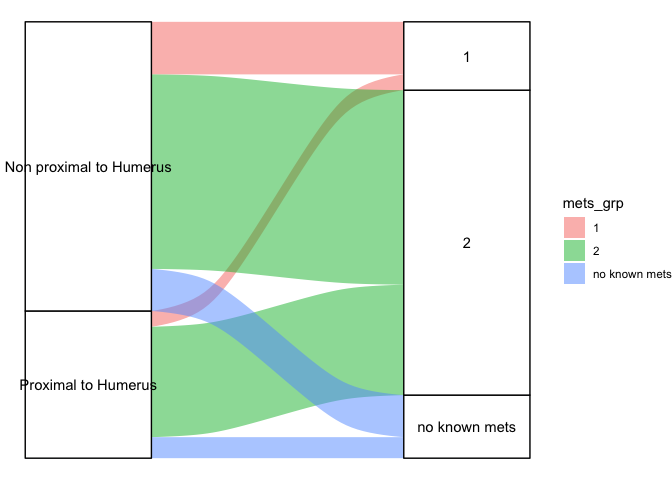

``` r
print(table(data.frame(Site = mm$PH, mets_grp = mm$Cluster)))
```

    ##                          mets_grp
    ## Site                       1  2 no known mets
    ##   Non proximal to Humerus 10 37             8
    ##   Proximal to Humerus      3 21             4

``` r
print(chisq.test(table(data.frame(Site = mm$PH, mets_grp = mm$Cluster))))
```

    ## Warning in chisq.test(table(data.frame(Site = mm$PH, mets_grp = mm$Cluster))):
    ## Chi-squared approximation may be incorrect

    ## 
    ##  Pearson's Chi-squared test
    ## 
    ## data:  table(data.frame(Site = mm$PH, mets_grp = mm$Cluster))
    ## X-squared = 0.82, df = 2, p-value = 0.6637

``` r
style_list <- list(cell_borders(sides = "top",color = "grey"))
gm_table <- 
 him_dat %>% 
  mmtable(cells = value) +
  header_left(mets_grp) +
  header_top(Site) +
  header_format(Site, scope = "table", style = style_list)
print(gm_table)
```

<style>#rvdgowkded table {
font-family: system-ui, 'Segoe UI', Roboto, Helvetica, Arial, sans-serif, 'Apple Color Emoji', 'Segoe UI Emoji', 'Segoe UI Symbol', 'Noto Color Emoji';
-webkit-font-smoothing: antialiased;
-moz-osx-font-smoothing: grayscale;
}
#rvdgowkded thead, #rvdgowkded tbody, #rvdgowkded tfoot, #rvdgowkded tr, #rvdgowkded td, #rvdgowkded th {
border-style: none;
}
#rvdgowkded p {
margin: 0;
padding: 0;
}
#rvdgowkded .gt_table {
display: table;
border-collapse: collapse;
line-height: normal;
margin-left: auto;
margin-right: auto;
color: #333333;
font-size: 16px;
font-weight: normal;
font-style: normal;
background-color: #FFFFFF;
width: auto;
border-top-style: solid;
border-top-width: 2px;
border-top-color: #A8A8A8;
border-right-style: none;
border-right-width: 2px;
border-right-color: #D3D3D3;
border-bottom-style: solid;
border-bottom-width: 2px;
border-bottom-color: #A8A8A8;
border-left-style: none;
border-left-width: 2px;
border-left-color: #D3D3D3;
}
#rvdgowkded .gt_caption {
padding-top: 4px;
padding-bottom: 4px;
}
#rvdgowkded .gt_title {
color: #333333;
font-size: 125%;
font-weight: initial;
padding-top: 4px;
padding-bottom: 4px;
padding-left: 5px;
padding-right: 5px;
border-bottom-color: #FFFFFF;
border-bottom-width: 0;
}
#rvdgowkded .gt_subtitle {
color: #333333;
font-size: 85%;
font-weight: initial;
padding-top: 3px;
padding-bottom: 5px;
padding-left: 5px;
padding-right: 5px;
border-top-color: #FFFFFF;
border-top-width: 0;
}
#rvdgowkded .gt_heading {
background-color: #FFFFFF;
text-align: center;
border-bottom-color: #FFFFFF;
border-left-style: none;
border-left-width: 1px;
border-left-color: #D3D3D3;
border-right-style: none;
border-right-width: 1px;
border-right-color: #D3D3D3;
}
#rvdgowkded .gt_bottom_border {
border-bottom-style: solid;
border-bottom-width: 2px;
border-bottom-color: #D3D3D3;
}
#rvdgowkded .gt_col_headings {
border-top-style: solid;
border-top-width: 2px;
border-top-color: #D3D3D3;
border-bottom-style: solid;
border-bottom-width: 2px;
border-bottom-color: #D3D3D3;
border-left-style: none;
border-left-width: 1px;
border-left-color: #D3D3D3;
border-right-style: none;
border-right-width: 1px;
border-right-color: #D3D3D3;
}
#rvdgowkded .gt_col_heading {
color: #333333;
background-color: #FFFFFF;
font-size: 100%;
font-weight: normal;
text-transform: inherit;
border-left-style: none;
border-left-width: 1px;
border-left-color: #D3D3D3;
border-right-style: none;
border-right-width: 1px;
border-right-color: #D3D3D3;
vertical-align: bottom;
padding-top: 5px;
padding-bottom: 6px;
padding-left: 5px;
padding-right: 5px;
overflow-x: hidden;
}
#rvdgowkded .gt_column_spanner_outer {
color: #333333;
background-color: #FFFFFF;
font-size: 100%;
font-weight: normal;
text-transform: inherit;
padding-top: 0;
padding-bottom: 0;
padding-left: 4px;
padding-right: 4px;
}
#rvdgowkded .gt_column_spanner_outer:first-child {
padding-left: 0;
}
#rvdgowkded .gt_column_spanner_outer:last-child {
padding-right: 0;
}
#rvdgowkded .gt_column_spanner {
border-bottom-style: solid;
border-bottom-width: 2px;
border-bottom-color: #D3D3D3;
vertical-align: bottom;
padding-top: 5px;
padding-bottom: 5px;
overflow-x: hidden;
display: inline-block;
width: 100%;
}
#rvdgowkded .gt_spanner_row {
border-bottom-style: hidden;
}
#rvdgowkded .gt_group_heading {
padding-top: 8px;
padding-bottom: 8px;
padding-left: 5px;
padding-right: 5px;
color: #333333;
background-color: #FFFFFF;
font-size: 100%;
font-weight: initial;
text-transform: inherit;
border-top-style: solid;
border-top-width: 2px;
border-top-color: #D3D3D3;
border-bottom-style: solid;
border-bottom-width: 2px;
border-bottom-color: #D3D3D3;
border-left-style: none;
border-left-width: 1px;
border-left-color: #D3D3D3;
border-right-style: none;
border-right-width: 1px;
border-right-color: #D3D3D3;
vertical-align: middle;
text-align: left;
}
#rvdgowkded .gt_empty_group_heading {
padding: 0.5px;
color: #333333;
background-color: #FFFFFF;
font-size: 100%;
font-weight: initial;
border-top-style: solid;
border-top-width: 2px;
border-top-color: #D3D3D3;
border-bottom-style: solid;
border-bottom-width: 2px;
border-bottom-color: #D3D3D3;
vertical-align: middle;
}
#rvdgowkded .gt_from_md > :first-child {
margin-top: 0;
}
#rvdgowkded .gt_from_md > :last-child {
margin-bottom: 0;
}
#rvdgowkded .gt_row {
padding-top: 8px;
padding-bottom: 8px;
padding-left: 5px;
padding-right: 5px;
margin: 10px;
border-top-style: solid;
border-top-width: 1px;
border-top-color: #D3D3D3;
border-left-style: none;
border-left-width: 1px;
border-left-color: #D3D3D3;
border-right-style: none;
border-right-width: 1px;
border-right-color: #D3D3D3;
vertical-align: middle;
overflow-x: hidden;
}
#rvdgowkded .gt_stub {
color: #333333;
background-color: #FFFFFF;
font-size: 100%;
font-weight: initial;
text-transform: inherit;
border-right-style: solid;
border-right-width: 2px;
border-right-color: #D3D3D3;
padding-left: 5px;
padding-right: 5px;
}
#rvdgowkded .gt_stub_row_group {
color: #333333;
background-color: #FFFFFF;
font-size: 100%;
font-weight: initial;
text-transform: inherit;
border-right-style: solid;
border-right-width: 2px;
border-right-color: #D3D3D3;
padding-left: 5px;
padding-right: 5px;
vertical-align: top;
}
#rvdgowkded .gt_row_group_first td {
border-top-width: 2px;
}
#rvdgowkded .gt_row_group_first th {
border-top-width: 2px;
}
#rvdgowkded .gt_summary_row {
color: #333333;
background-color: #FFFFFF;
text-transform: inherit;
padding-top: 8px;
padding-bottom: 8px;
padding-left: 5px;
padding-right: 5px;
}
#rvdgowkded .gt_first_summary_row {
border-top-style: solid;
border-top-color: #D3D3D3;
}
#rvdgowkded .gt_first_summary_row.thick {
border-top-width: 2px;
}
#rvdgowkded .gt_last_summary_row {
padding-top: 8px;
padding-bottom: 8px;
padding-left: 5px;
padding-right: 5px;
border-bottom-style: solid;
border-bottom-width: 2px;
border-bottom-color: #D3D3D3;
}
#rvdgowkded .gt_grand_summary_row {
color: #333333;
background-color: #FFFFFF;
text-transform: inherit;
padding-top: 8px;
padding-bottom: 8px;
padding-left: 5px;
padding-right: 5px;
}
#rvdgowkded .gt_first_grand_summary_row {
padding-top: 8px;
padding-bottom: 8px;
padding-left: 5px;
padding-right: 5px;
border-top-style: double;
border-top-width: 6px;
border-top-color: #D3D3D3;
}
#rvdgowkded .gt_last_grand_summary_row_top {
padding-top: 8px;
padding-bottom: 8px;
padding-left: 5px;
padding-right: 5px;
border-bottom-style: double;
border-bottom-width: 6px;
border-bottom-color: #D3D3D3;
}
#rvdgowkded .gt_striped {
background-color: rgba(128, 128, 128, 0.05);
}
#rvdgowkded .gt_table_body {
border-top-style: solid;
border-top-width: 2px;
border-top-color: #D3D3D3;
border-bottom-style: solid;
border-bottom-width: 2px;
border-bottom-color: #D3D3D3;
}
#rvdgowkded .gt_footnotes {
color: #333333;
background-color: #FFFFFF;
border-bottom-style: none;
border-bottom-width: 2px;
border-bottom-color: #D3D3D3;
border-left-style: none;
border-left-width: 2px;
border-left-color: #D3D3D3;
border-right-style: none;
border-right-width: 2px;
border-right-color: #D3D3D3;
}
#rvdgowkded .gt_footnote {
margin: 0px;
font-size: 90%;
padding-top: 4px;
padding-bottom: 4px;
padding-left: 5px;
padding-right: 5px;
}
#rvdgowkded .gt_sourcenotes {
color: #333333;
background-color: #FFFFFF;
border-bottom-style: none;
border-bottom-width: 2px;
border-bottom-color: #D3D3D3;
border-left-style: none;
border-left-width: 2px;
border-left-color: #D3D3D3;
border-right-style: none;
border-right-width: 2px;
border-right-color: #D3D3D3;
}
#rvdgowkded .gt_sourcenote {
font-size: 90%;
padding-top: 4px;
padding-bottom: 4px;
padding-left: 5px;
padding-right: 5px;
}
#rvdgowkded .gt_left {
text-align: left;
}
#rvdgowkded .gt_center {
text-align: center;
}
#rvdgowkded .gt_right {
text-align: right;
font-variant-numeric: tabular-nums;
}
#rvdgowkded .gt_font_normal {
font-weight: normal;
}
#rvdgowkded .gt_font_bold {
font-weight: bold;
}
#rvdgowkded .gt_font_italic {
font-style: italic;
}
#rvdgowkded .gt_super {
font-size: 65%;
}
#rvdgowkded .gt_footnote_marks {
font-size: 75%;
vertical-align: 0.4em;
position: initial;
}
#rvdgowkded .gt_asterisk {
font-size: 100%;
vertical-align: 0;
}
#rvdgowkded .gt_indent_1 {
text-indent: 5px;
}
#rvdgowkded .gt_indent_2 {
text-indent: 10px;
}
#rvdgowkded .gt_indent_3 {
text-indent: 15px;
}
#rvdgowkded .gt_indent_4 {
text-indent: 20px;
}
#rvdgowkded .gt_indent_5 {
text-indent: 25px;
}
</style>
<table class="gt_table" data-quarto-disable-processing="false" data-quarto-bootstrap="false">
<tbody class="gt_table_body">
<tr>
<td headers class="gt_row gt_left" style="background-color: #FFFFFF; color: #000000; font-size: 12px;">
</td>
<td headers class="gt_row gt_left" style="background-color: #FFFFFF; color: #000000; font-size: 12px; text-align: right; font-weight: bold; border-top-width: 1px; border-top-style: solid; border-top-color: grey;">
Non proximal to Humerus
</td>
<td headers class="gt_row gt_left" style="background-color: #FFFFFF; color: #000000; font-size: 12px; text-align: right; font-weight: bold; border-top-width: 1px; border-top-style: solid; border-top-color: grey;">
Proximal to Humerus
</td>
</tr>
<tr>
<td headers class="gt_row gt_left" style="background-color: #FFFFFF; color: #000000; font-size: 12px; font-weight: bold;">
1
</td>
<td headers class="gt_row gt_left" style="background-color: #FFFFFF; color: #000000; font-size: 12px; text-align: right; border-top-width: 1px; border-top-style: solid; border-top-color: grey;">
10
</td>
<td headers class="gt_row gt_left" style="background-color: #FFFFFF; color: #000000; font-size: 12px; text-align: right; border-top-width: 1px; border-top-style: solid; border-top-color: grey;">
3
</td>
</tr>
<tr>
<td headers class="gt_row gt_left" style="background-color: #FFFFFF; color: #000000; font-size: 12px; font-weight: bold;">
2
</td>
<td headers class="gt_row gt_left" style="background-color: #FFFFFF; color: #000000; font-size: 12px; text-align: right; border-top-width: 1px; border-top-style: solid; border-top-color: grey;">
37
</td>
<td headers class="gt_row gt_left" style="background-color: #FFFFFF; color: #000000; font-size: 12px; text-align: right; border-top-width: 1px; border-top-style: solid; border-top-color: grey;">
21
</td>
</tr>
<tr>
<td headers class="gt_row gt_left" style="background-color: #FFFFFF; color: #000000; font-size: 12px; font-weight: bold;">
no known mets
</td>
<td headers class="gt_row gt_left" style="background-color: #FFFFFF; color: #000000; font-size: 12px; text-align: right; border-top-width: 1px; border-top-style: solid; border-top-color: grey;">
8
</td>
<td headers class="gt_row gt_left" style="background-color: #FFFFFF; color: #000000; font-size: 12px; text-align: right; border-top-width: 1px; border-top-style: solid; border-top-color: grey;">
4
</td>
</tr>
</tbody>
</table>

``` r
pdf("~/Dog/mets_tumorlocation.pdf")
print(gm_table)
```

<style>#qbcqwrtcrd table {
font-family: system-ui, 'Segoe UI', Roboto, Helvetica, Arial, sans-serif, 'Apple Color Emoji', 'Segoe UI Emoji', 'Segoe UI Symbol', 'Noto Color Emoji';
-webkit-font-smoothing: antialiased;
-moz-osx-font-smoothing: grayscale;
}
#qbcqwrtcrd thead, #qbcqwrtcrd tbody, #qbcqwrtcrd tfoot, #qbcqwrtcrd tr, #qbcqwrtcrd td, #qbcqwrtcrd th {
border-style: none;
}
#qbcqwrtcrd p {
margin: 0;
padding: 0;
}
#qbcqwrtcrd .gt_table {
display: table;
border-collapse: collapse;
line-height: normal;
margin-left: auto;
margin-right: auto;
color: #333333;
font-size: 16px;
font-weight: normal;
font-style: normal;
background-color: #FFFFFF;
width: auto;
border-top-style: solid;
border-top-width: 2px;
border-top-color: #A8A8A8;
border-right-style: none;
border-right-width: 2px;
border-right-color: #D3D3D3;
border-bottom-style: solid;
border-bottom-width: 2px;
border-bottom-color: #A8A8A8;
border-left-style: none;
border-left-width: 2px;
border-left-color: #D3D3D3;
}
#qbcqwrtcrd .gt_caption {
padding-top: 4px;
padding-bottom: 4px;
}
#qbcqwrtcrd .gt_title {
color: #333333;
font-size: 125%;
font-weight: initial;
padding-top: 4px;
padding-bottom: 4px;
padding-left: 5px;
padding-right: 5px;
border-bottom-color: #FFFFFF;
border-bottom-width: 0;
}
#qbcqwrtcrd .gt_subtitle {
color: #333333;
font-size: 85%;
font-weight: initial;
padding-top: 3px;
padding-bottom: 5px;
padding-left: 5px;
padding-right: 5px;
border-top-color: #FFFFFF;
border-top-width: 0;
}
#qbcqwrtcrd .gt_heading {
background-color: #FFFFFF;
text-align: center;
border-bottom-color: #FFFFFF;
border-left-style: none;
border-left-width: 1px;
border-left-color: #D3D3D3;
border-right-style: none;
border-right-width: 1px;
border-right-color: #D3D3D3;
}
#qbcqwrtcrd .gt_bottom_border {
border-bottom-style: solid;
border-bottom-width: 2px;
border-bottom-color: #D3D3D3;
}
#qbcqwrtcrd .gt_col_headings {
border-top-style: solid;
border-top-width: 2px;
border-top-color: #D3D3D3;
border-bottom-style: solid;
border-bottom-width: 2px;
border-bottom-color: #D3D3D3;
border-left-style: none;
border-left-width: 1px;
border-left-color: #D3D3D3;
border-right-style: none;
border-right-width: 1px;
border-right-color: #D3D3D3;
}
#qbcqwrtcrd .gt_col_heading {
color: #333333;
background-color: #FFFFFF;
font-size: 100%;
font-weight: normal;
text-transform: inherit;
border-left-style: none;
border-left-width: 1px;
border-left-color: #D3D3D3;
border-right-style: none;
border-right-width: 1px;
border-right-color: #D3D3D3;
vertical-align: bottom;
padding-top: 5px;
padding-bottom: 6px;
padding-left: 5px;
padding-right: 5px;
overflow-x: hidden;
}
#qbcqwrtcrd .gt_column_spanner_outer {
color: #333333;
background-color: #FFFFFF;
font-size: 100%;
font-weight: normal;
text-transform: inherit;
padding-top: 0;
padding-bottom: 0;
padding-left: 4px;
padding-right: 4px;
}
#qbcqwrtcrd .gt_column_spanner_outer:first-child {
padding-left: 0;
}
#qbcqwrtcrd .gt_column_spanner_outer:last-child {
padding-right: 0;
}
#qbcqwrtcrd .gt_column_spanner {
border-bottom-style: solid;
border-bottom-width: 2px;
border-bottom-color: #D3D3D3;
vertical-align: bottom;
padding-top: 5px;
padding-bottom: 5px;
overflow-x: hidden;
display: inline-block;
width: 100%;
}
#qbcqwrtcrd .gt_spanner_row {
border-bottom-style: hidden;
}
#qbcqwrtcrd .gt_group_heading {
padding-top: 8px;
padding-bottom: 8px;
padding-left: 5px;
padding-right: 5px;
color: #333333;
background-color: #FFFFFF;
font-size: 100%;
font-weight: initial;
text-transform: inherit;
border-top-style: solid;
border-top-width: 2px;
border-top-color: #D3D3D3;
border-bottom-style: solid;
border-bottom-width: 2px;
border-bottom-color: #D3D3D3;
border-left-style: none;
border-left-width: 1px;
border-left-color: #D3D3D3;
border-right-style: none;
border-right-width: 1px;
border-right-color: #D3D3D3;
vertical-align: middle;
text-align: left;
}
#qbcqwrtcrd .gt_empty_group_heading {
padding: 0.5px;
color: #333333;
background-color: #FFFFFF;
font-size: 100%;
font-weight: initial;
border-top-style: solid;
border-top-width: 2px;
border-top-color: #D3D3D3;
border-bottom-style: solid;
border-bottom-width: 2px;
border-bottom-color: #D3D3D3;
vertical-align: middle;
}
#qbcqwrtcrd .gt_from_md > :first-child {
margin-top: 0;
}
#qbcqwrtcrd .gt_from_md > :last-child {
margin-bottom: 0;
}
#qbcqwrtcrd .gt_row {
padding-top: 8px;
padding-bottom: 8px;
padding-left: 5px;
padding-right: 5px;
margin: 10px;
border-top-style: solid;
border-top-width: 1px;
border-top-color: #D3D3D3;
border-left-style: none;
border-left-width: 1px;
border-left-color: #D3D3D3;
border-right-style: none;
border-right-width: 1px;
border-right-color: #D3D3D3;
vertical-align: middle;
overflow-x: hidden;
}
#qbcqwrtcrd .gt_stub {
color: #333333;
background-color: #FFFFFF;
font-size: 100%;
font-weight: initial;
text-transform: inherit;
border-right-style: solid;
border-right-width: 2px;
border-right-color: #D3D3D3;
padding-left: 5px;
padding-right: 5px;
}
#qbcqwrtcrd .gt_stub_row_group {
color: #333333;
background-color: #FFFFFF;
font-size: 100%;
font-weight: initial;
text-transform: inherit;
border-right-style: solid;
border-right-width: 2px;
border-right-color: #D3D3D3;
padding-left: 5px;
padding-right: 5px;
vertical-align: top;
}
#qbcqwrtcrd .gt_row_group_first td {
border-top-width: 2px;
}
#qbcqwrtcrd .gt_row_group_first th {
border-top-width: 2px;
}
#qbcqwrtcrd .gt_summary_row {
color: #333333;
background-color: #FFFFFF;
text-transform: inherit;
padding-top: 8px;
padding-bottom: 8px;
padding-left: 5px;
padding-right: 5px;
}
#qbcqwrtcrd .gt_first_summary_row {
border-top-style: solid;
border-top-color: #D3D3D3;
}
#qbcqwrtcrd .gt_first_summary_row.thick {
border-top-width: 2px;
}
#qbcqwrtcrd .gt_last_summary_row {
padding-top: 8px;
padding-bottom: 8px;
padding-left: 5px;
padding-right: 5px;
border-bottom-style: solid;
border-bottom-width: 2px;
border-bottom-color: #D3D3D3;
}
#qbcqwrtcrd .gt_grand_summary_row {
color: #333333;
background-color: #FFFFFF;
text-transform: inherit;
padding-top: 8px;
padding-bottom: 8px;
padding-left: 5px;
padding-right: 5px;
}
#qbcqwrtcrd .gt_first_grand_summary_row {
padding-top: 8px;
padding-bottom: 8px;
padding-left: 5px;
padding-right: 5px;
border-top-style: double;
border-top-width: 6px;
border-top-color: #D3D3D3;
}
#qbcqwrtcrd .gt_last_grand_summary_row_top {
padding-top: 8px;
padding-bottom: 8px;
padding-left: 5px;
padding-right: 5px;
border-bottom-style: double;
border-bottom-width: 6px;
border-bottom-color: #D3D3D3;
}
#qbcqwrtcrd .gt_striped {
background-color: rgba(128, 128, 128, 0.05);
}
#qbcqwrtcrd .gt_table_body {
border-top-style: solid;
border-top-width: 2px;
border-top-color: #D3D3D3;
border-bottom-style: solid;
border-bottom-width: 2px;
border-bottom-color: #D3D3D3;
}
#qbcqwrtcrd .gt_footnotes {
color: #333333;
background-color: #FFFFFF;
border-bottom-style: none;
border-bottom-width: 2px;
border-bottom-color: #D3D3D3;
border-left-style: none;
border-left-width: 2px;
border-left-color: #D3D3D3;
border-right-style: none;
border-right-width: 2px;
border-right-color: #D3D3D3;
}
#qbcqwrtcrd .gt_footnote {
margin: 0px;
font-size: 90%;
padding-top: 4px;
padding-bottom: 4px;
padding-left: 5px;
padding-right: 5px;
}
#qbcqwrtcrd .gt_sourcenotes {
color: #333333;
background-color: #FFFFFF;
border-bottom-style: none;
border-bottom-width: 2px;
border-bottom-color: #D3D3D3;
border-left-style: none;
border-left-width: 2px;
border-left-color: #D3D3D3;
border-right-style: none;
border-right-width: 2px;
border-right-color: #D3D3D3;
}
#qbcqwrtcrd .gt_sourcenote {
font-size: 90%;
padding-top: 4px;
padding-bottom: 4px;
padding-left: 5px;
padding-right: 5px;
}
#qbcqwrtcrd .gt_left {
text-align: left;
}
#qbcqwrtcrd .gt_center {
text-align: center;
}
#qbcqwrtcrd .gt_right {
text-align: right;
font-variant-numeric: tabular-nums;
}
#qbcqwrtcrd .gt_font_normal {
font-weight: normal;
}
#qbcqwrtcrd .gt_font_bold {
font-weight: bold;
}
#qbcqwrtcrd .gt_font_italic {
font-style: italic;
}
#qbcqwrtcrd .gt_super {
font-size: 65%;
}
#qbcqwrtcrd .gt_footnote_marks {
font-size: 75%;
vertical-align: 0.4em;
position: initial;
}
#qbcqwrtcrd .gt_asterisk {
font-size: 100%;
vertical-align: 0;
}
#qbcqwrtcrd .gt_indent_1 {
text-indent: 5px;
}
#qbcqwrtcrd .gt_indent_2 {
text-indent: 10px;
}
#qbcqwrtcrd .gt_indent_3 {
text-indent: 15px;
}
#qbcqwrtcrd .gt_indent_4 {
text-indent: 20px;
}
#qbcqwrtcrd .gt_indent_5 {
text-indent: 25px;
}
</style>
<table class="gt_table" data-quarto-disable-processing="false" data-quarto-bootstrap="false">
<tbody class="gt_table_body">
<tr>
<td headers class="gt_row gt_left" style="background-color: #FFFFFF; color: #000000; font-size: 12px;">
</td>
<td headers class="gt_row gt_left" style="background-color: #FFFFFF; color: #000000; font-size: 12px; text-align: right; font-weight: bold; border-top-width: 1px; border-top-style: solid; border-top-color: grey;">
Non proximal to Humerus
</td>
<td headers class="gt_row gt_left" style="background-color: #FFFFFF; color: #000000; font-size: 12px; text-align: right; font-weight: bold; border-top-width: 1px; border-top-style: solid; border-top-color: grey;">
Proximal to Humerus
</td>
</tr>
<tr>
<td headers class="gt_row gt_left" style="background-color: #FFFFFF; color: #000000; font-size: 12px; font-weight: bold;">
1
</td>
<td headers class="gt_row gt_left" style="background-color: #FFFFFF; color: #000000; font-size: 12px; text-align: right; border-top-width: 1px; border-top-style: solid; border-top-color: grey;">
10
</td>
<td headers class="gt_row gt_left" style="background-color: #FFFFFF; color: #000000; font-size: 12px; text-align: right; border-top-width: 1px; border-top-style: solid; border-top-color: grey;">
3
</td>
</tr>
<tr>
<td headers class="gt_row gt_left" style="background-color: #FFFFFF; color: #000000; font-size: 12px; font-weight: bold;">
2
</td>
<td headers class="gt_row gt_left" style="background-color: #FFFFFF; color: #000000; font-size: 12px; text-align: right; border-top-width: 1px; border-top-style: solid; border-top-color: grey;">
37
</td>
<td headers class="gt_row gt_left" style="background-color: #FFFFFF; color: #000000; font-size: 12px; text-align: right; border-top-width: 1px; border-top-style: solid; border-top-color: grey;">
21
</td>
</tr>
<tr>
<td headers class="gt_row gt_left" style="background-color: #FFFFFF; color: #000000; font-size: 12px; font-weight: bold;">
no known mets
</td>
<td headers class="gt_row gt_left" style="background-color: #FFFFFF; color: #000000; font-size: 12px; text-align: right; border-top-width: 1px; border-top-style: solid; border-top-color: grey;">
8
</td>
<td headers class="gt_row gt_left" style="background-color: #FFFFFF; color: #000000; font-size: 12px; text-align: right; border-top-width: 1px; border-top-style: solid; border-top-color: grey;">
4
</td>
</tr>
</tbody>
</table>

``` r
dev.off()
```

    ## quartz_off_screen 
    ##                 2

#Univariate correlation analysis of metastatic outgrowth patterns with
ALP levels

``` r
him_dat <- melt(table(data.frame(Site = mm$ALP, mets_grp = mm$Cluster)))
```

    ## Warning in melt(table(data.frame(Site = mm$ALP, mets_grp = mm$Cluster))): The
    ## melt generic in data.table has been passed a table and will attempt to redirect
    ## to the relevant reshape2 method; please note that reshape2 is deprecated, and
    ## this redirection is now deprecated as well. To continue using melt methods from
    ## reshape2 while both libraries are attached, e.g. melt.list, you can prepend the
    ## namespace like reshape2::melt(table(data.frame(Site = mm$ALP, mets_grp =
    ## mm$Cluster))). In the next version, this warning will become an error.

``` r
pp <-ggplot(data = him_dat,
       aes(axis1 = Site, axis2 = mets_grp, y = value)) +
  geom_alluvium(aes(fill = mets_grp)) +
  geom_stratum() +
  geom_text(stat = "stratum",
            aes(label = after_stat(stratum))) +
  theme_void()

print(pp)
```

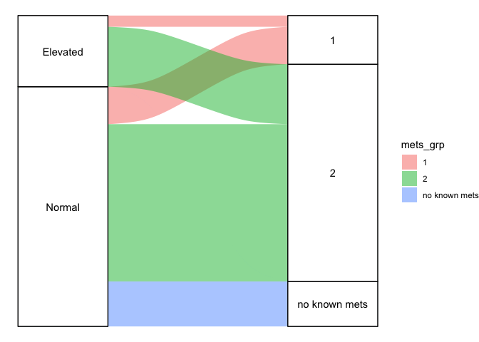

``` r
print(table(data.frame(Site = mm$ALP, mets_grp = mm$Cluster)))
```

    ##           mets_grp
    ## Site        1  2 no known mets
    ##   Elevated  3 16             0
    ##   Normal   10 42            12

``` r
print(chisq.test(table(data.frame(Site = mm$ALP, mets_grp = mm$Cluster))))
```

    ## Warning in chisq.test(table(data.frame(Site = mm$ALP, mets_grp = mm$Cluster))):
    ## Chi-squared approximation may be incorrect

    ## 
    ##  Pearson's Chi-squared test
    ## 
    ## data:  table(data.frame(Site = mm$ALP, mets_grp = mm$Cluster))
    ## X-squared = 4.2869, df = 2, p-value = 0.1172

``` r
style_list <- list(cell_borders(sides = "top",color = "grey"))
gm_table <- 
 him_dat %>% 
  mmtable(cells = value) +
  header_left(mets_grp) +
  header_top(Site) +
  header_format(Site, scope = "table", style = style_list)
print(gm_table)
```

<style>#gznjtgbsoa table {
font-family: system-ui, 'Segoe UI', Roboto, Helvetica, Arial, sans-serif, 'Apple Color Emoji', 'Segoe UI Emoji', 'Segoe UI Symbol', 'Noto Color Emoji';
-webkit-font-smoothing: antialiased;
-moz-osx-font-smoothing: grayscale;
}
#gznjtgbsoa thead, #gznjtgbsoa tbody, #gznjtgbsoa tfoot, #gznjtgbsoa tr, #gznjtgbsoa td, #gznjtgbsoa th {
border-style: none;
}
#gznjtgbsoa p {
margin: 0;
padding: 0;
}
#gznjtgbsoa .gt_table {
display: table;
border-collapse: collapse;
line-height: normal;
margin-left: auto;
margin-right: auto;
color: #333333;
font-size: 16px;
font-weight: normal;
font-style: normal;
background-color: #FFFFFF;
width: auto;
border-top-style: solid;
border-top-width: 2px;
border-top-color: #A8A8A8;
border-right-style: none;
border-right-width: 2px;
border-right-color: #D3D3D3;
border-bottom-style: solid;
border-bottom-width: 2px;
border-bottom-color: #A8A8A8;
border-left-style: none;
border-left-width: 2px;
border-left-color: #D3D3D3;
}
#gznjtgbsoa .gt_caption {
padding-top: 4px;
padding-bottom: 4px;
}
#gznjtgbsoa .gt_title {
color: #333333;
font-size: 125%;
font-weight: initial;
padding-top: 4px;
padding-bottom: 4px;
padding-left: 5px;
padding-right: 5px;
border-bottom-color: #FFFFFF;
border-bottom-width: 0;
}
#gznjtgbsoa .gt_subtitle {
color: #333333;
font-size: 85%;
font-weight: initial;
padding-top: 3px;
padding-bottom: 5px;
padding-left: 5px;
padding-right: 5px;
border-top-color: #FFFFFF;
border-top-width: 0;
}
#gznjtgbsoa .gt_heading {
background-color: #FFFFFF;
text-align: center;
border-bottom-color: #FFFFFF;
border-left-style: none;
border-left-width: 1px;
border-left-color: #D3D3D3;
border-right-style: none;
border-right-width: 1px;
border-right-color: #D3D3D3;
}
#gznjtgbsoa .gt_bottom_border {
border-bottom-style: solid;
border-bottom-width: 2px;
border-bottom-color: #D3D3D3;
}
#gznjtgbsoa .gt_col_headings {
border-top-style: solid;
border-top-width: 2px;
border-top-color: #D3D3D3;
border-bottom-style: solid;
border-bottom-width: 2px;
border-bottom-color: #D3D3D3;
border-left-style: none;
border-left-width: 1px;
border-left-color: #D3D3D3;
border-right-style: none;
border-right-width: 1px;
border-right-color: #D3D3D3;
}
#gznjtgbsoa .gt_col_heading {
color: #333333;
background-color: #FFFFFF;
font-size: 100%;
font-weight: normal;
text-transform: inherit;
border-left-style: none;
border-left-width: 1px;
border-left-color: #D3D3D3;
border-right-style: none;
border-right-width: 1px;
border-right-color: #D3D3D3;
vertical-align: bottom;
padding-top: 5px;
padding-bottom: 6px;
padding-left: 5px;
padding-right: 5px;
overflow-x: hidden;
}
#gznjtgbsoa .gt_column_spanner_outer {
color: #333333;
background-color: #FFFFFF;
font-size: 100%;
font-weight: normal;
text-transform: inherit;
padding-top: 0;
padding-bottom: 0;
padding-left: 4px;
padding-right: 4px;
}
#gznjtgbsoa .gt_column_spanner_outer:first-child {
padding-left: 0;
}
#gznjtgbsoa .gt_column_spanner_outer:last-child {
padding-right: 0;
}
#gznjtgbsoa .gt_column_spanner {
border-bottom-style: solid;
border-bottom-width: 2px;
border-bottom-color: #D3D3D3;
vertical-align: bottom;
padding-top: 5px;
padding-bottom: 5px;
overflow-x: hidden;
display: inline-block;
width: 100%;
}
#gznjtgbsoa .gt_spanner_row {
border-bottom-style: hidden;
}
#gznjtgbsoa .gt_group_heading {
padding-top: 8px;
padding-bottom: 8px;
padding-left: 5px;
padding-right: 5px;
color: #333333;
background-color: #FFFFFF;
font-size: 100%;
font-weight: initial;
text-transform: inherit;
border-top-style: solid;
border-top-width: 2px;
border-top-color: #D3D3D3;
border-bottom-style: solid;
border-bottom-width: 2px;
border-bottom-color: #D3D3D3;
border-left-style: none;
border-left-width: 1px;
border-left-color: #D3D3D3;
border-right-style: none;
border-right-width: 1px;
border-right-color: #D3D3D3;
vertical-align: middle;
text-align: left;
}
#gznjtgbsoa .gt_empty_group_heading {
padding: 0.5px;
color: #333333;
background-color: #FFFFFF;
font-size: 100%;
font-weight: initial;
border-top-style: solid;
border-top-width: 2px;
border-top-color: #D3D3D3;
border-bottom-style: solid;
border-bottom-width: 2px;
border-bottom-color: #D3D3D3;
vertical-align: middle;
}
#gznjtgbsoa .gt_from_md > :first-child {
margin-top: 0;
}
#gznjtgbsoa .gt_from_md > :last-child {
margin-bottom: 0;
}
#gznjtgbsoa .gt_row {
padding-top: 8px;
padding-bottom: 8px;
padding-left: 5px;
padding-right: 5px;
margin: 10px;
border-top-style: solid;
border-top-width: 1px;
border-top-color: #D3D3D3;
border-left-style: none;
border-left-width: 1px;
border-left-color: #D3D3D3;
border-right-style: none;
border-right-width: 1px;
border-right-color: #D3D3D3;
vertical-align: middle;
overflow-x: hidden;
}
#gznjtgbsoa .gt_stub {
color: #333333;
background-color: #FFFFFF;
font-size: 100%;
font-weight: initial;
text-transform: inherit;
border-right-style: solid;
border-right-width: 2px;
border-right-color: #D3D3D3;
padding-left: 5px;
padding-right: 5px;
}
#gznjtgbsoa .gt_stub_row_group {
color: #333333;
background-color: #FFFFFF;
font-size: 100%;
font-weight: initial;
text-transform: inherit;
border-right-style: solid;
border-right-width: 2px;
border-right-color: #D3D3D3;
padding-left: 5px;
padding-right: 5px;
vertical-align: top;
}
#gznjtgbsoa .gt_row_group_first td {
border-top-width: 2px;
}
#gznjtgbsoa .gt_row_group_first th {
border-top-width: 2px;
}
#gznjtgbsoa .gt_summary_row {
color: #333333;
background-color: #FFFFFF;
text-transform: inherit;
padding-top: 8px;
padding-bottom: 8px;
padding-left: 5px;
padding-right: 5px;
}
#gznjtgbsoa .gt_first_summary_row {
border-top-style: solid;
border-top-color: #D3D3D3;
}
#gznjtgbsoa .gt_first_summary_row.thick {
border-top-width: 2px;
}
#gznjtgbsoa .gt_last_summary_row {
padding-top: 8px;
padding-bottom: 8px;
padding-left: 5px;
padding-right: 5px;
border-bottom-style: solid;
border-bottom-width: 2px;
border-bottom-color: #D3D3D3;
}
#gznjtgbsoa .gt_grand_summary_row {
color: #333333;
background-color: #FFFFFF;
text-transform: inherit;
padding-top: 8px;
padding-bottom: 8px;
padding-left: 5px;
padding-right: 5px;
}
#gznjtgbsoa .gt_first_grand_summary_row {
padding-top: 8px;
padding-bottom: 8px;
padding-left: 5px;
padding-right: 5px;
border-top-style: double;
border-top-width: 6px;
border-top-color: #D3D3D3;
}
#gznjtgbsoa .gt_last_grand_summary_row_top {
padding-top: 8px;
padding-bottom: 8px;
padding-left: 5px;
padding-right: 5px;
border-bottom-style: double;
border-bottom-width: 6px;
border-bottom-color: #D3D3D3;
}
#gznjtgbsoa .gt_striped {
background-color: rgba(128, 128, 128, 0.05);
}
#gznjtgbsoa .gt_table_body {
border-top-style: solid;
border-top-width: 2px;
border-top-color: #D3D3D3;
border-bottom-style: solid;
border-bottom-width: 2px;
border-bottom-color: #D3D3D3;
}
#gznjtgbsoa .gt_footnotes {
color: #333333;
background-color: #FFFFFF;
border-bottom-style: none;
border-bottom-width: 2px;
border-bottom-color: #D3D3D3;
border-left-style: none;
border-left-width: 2px;
border-left-color: #D3D3D3;
border-right-style: none;
border-right-width: 2px;
border-right-color: #D3D3D3;
}
#gznjtgbsoa .gt_footnote {
margin: 0px;
font-size: 90%;
padding-top: 4px;
padding-bottom: 4px;
padding-left: 5px;
padding-right: 5px;
}
#gznjtgbsoa .gt_sourcenotes {
color: #333333;
background-color: #FFFFFF;
border-bottom-style: none;
border-bottom-width: 2px;
border-bottom-color: #D3D3D3;
border-left-style: none;
border-left-width: 2px;
border-left-color: #D3D3D3;
border-right-style: none;
border-right-width: 2px;
border-right-color: #D3D3D3;
}
#gznjtgbsoa .gt_sourcenote {
font-size: 90%;
padding-top: 4px;
padding-bottom: 4px;
padding-left: 5px;
padding-right: 5px;
}
#gznjtgbsoa .gt_left {
text-align: left;
}
#gznjtgbsoa .gt_center {
text-align: center;
}
#gznjtgbsoa .gt_right {
text-align: right;
font-variant-numeric: tabular-nums;
}
#gznjtgbsoa .gt_font_normal {
font-weight: normal;
}
#gznjtgbsoa .gt_font_bold {
font-weight: bold;
}
#gznjtgbsoa .gt_font_italic {
font-style: italic;
}
#gznjtgbsoa .gt_super {
font-size: 65%;
}
#gznjtgbsoa .gt_footnote_marks {
font-size: 75%;
vertical-align: 0.4em;
position: initial;
}
#gznjtgbsoa .gt_asterisk {
font-size: 100%;
vertical-align: 0;
}
#gznjtgbsoa .gt_indent_1 {
text-indent: 5px;
}
#gznjtgbsoa .gt_indent_2 {
text-indent: 10px;
}
#gznjtgbsoa .gt_indent_3 {
text-indent: 15px;
}
#gznjtgbsoa .gt_indent_4 {
text-indent: 20px;
}
#gznjtgbsoa .gt_indent_5 {
text-indent: 25px;
}
</style>
<table class="gt_table" data-quarto-disable-processing="false" data-quarto-bootstrap="false">
<tbody class="gt_table_body">
<tr>
<td headers class="gt_row gt_left" style="background-color: #FFFFFF; color: #000000; font-size: 12px;">
</td>
<td headers class="gt_row gt_left" style="background-color: #FFFFFF; color: #000000; font-size: 12px; text-align: right; font-weight: bold; border-top-width: 1px; border-top-style: solid; border-top-color: grey;">
Elevated
</td>
<td headers class="gt_row gt_left" style="background-color: #FFFFFF; color: #000000; font-size: 12px; text-align: right; font-weight: bold; border-top-width: 1px; border-top-style: solid; border-top-color: grey;">
Normal
</td>
</tr>
<tr>
<td headers class="gt_row gt_left" style="background-color: #FFFFFF; color: #000000; font-size: 12px; font-weight: bold;">
1
</td>
<td headers class="gt_row gt_left" style="background-color: #FFFFFF; color: #000000; font-size: 12px; text-align: right; border-top-width: 1px; border-top-style: solid; border-top-color: grey;">
3
</td>
<td headers class="gt_row gt_left" style="background-color: #FFFFFF; color: #000000; font-size: 12px; text-align: right; border-top-width: 1px; border-top-style: solid; border-top-color: grey;">
10
</td>
</tr>
<tr>
<td headers class="gt_row gt_left" style="background-color: #FFFFFF; color: #000000; font-size: 12px; font-weight: bold;">
2
</td>
<td headers class="gt_row gt_left" style="background-color: #FFFFFF; color: #000000; font-size: 12px; text-align: right; border-top-width: 1px; border-top-style: solid; border-top-color: grey;">
16
</td>
<td headers class="gt_row gt_left" style="background-color: #FFFFFF; color: #000000; font-size: 12px; text-align: right; border-top-width: 1px; border-top-style: solid; border-top-color: grey;">
42
</td>
</tr>
<tr>
<td headers class="gt_row gt_left" style="background-color: #FFFFFF; color: #000000; font-size: 12px; font-weight: bold;">
no known mets
</td>
<td headers class="gt_row gt_left" style="background-color: #FFFFFF; color: #000000; font-size: 12px; text-align: right; border-top-width: 1px; border-top-style: solid; border-top-color: grey;">
0
</td>
<td headers class="gt_row gt_left" style="background-color: #FFFFFF; color: #000000; font-size: 12px; text-align: right; border-top-width: 1px; border-top-style: solid; border-top-color: grey;">
12
</td>
</tr>
</tbody>
</table>

``` r
pdf("~/Dog/mets_ALP.pdf")
print(gm_table)
```

<style>#ivbshfhshd table {
font-family: system-ui, 'Segoe UI', Roboto, Helvetica, Arial, sans-serif, 'Apple Color Emoji', 'Segoe UI Emoji', 'Segoe UI Symbol', 'Noto Color Emoji';
-webkit-font-smoothing: antialiased;
-moz-osx-font-smoothing: grayscale;
}
#ivbshfhshd thead, #ivbshfhshd tbody, #ivbshfhshd tfoot, #ivbshfhshd tr, #ivbshfhshd td, #ivbshfhshd th {
border-style: none;
}
#ivbshfhshd p {
margin: 0;
padding: 0;
}
#ivbshfhshd .gt_table {
display: table;
border-collapse: collapse;
line-height: normal;
margin-left: auto;
margin-right: auto;
color: #333333;
font-size: 16px;
font-weight: normal;
font-style: normal;
background-color: #FFFFFF;
width: auto;
border-top-style: solid;
border-top-width: 2px;
border-top-color: #A8A8A8;
border-right-style: none;
border-right-width: 2px;
border-right-color: #D3D3D3;
border-bottom-style: solid;
border-bottom-width: 2px;
border-bottom-color: #A8A8A8;
border-left-style: none;
border-left-width: 2px;
border-left-color: #D3D3D3;
}
#ivbshfhshd .gt_caption {
padding-top: 4px;
padding-bottom: 4px;
}
#ivbshfhshd .gt_title {
color: #333333;
font-size: 125%;
font-weight: initial;
padding-top: 4px;
padding-bottom: 4px;
padding-left: 5px;
padding-right: 5px;
border-bottom-color: #FFFFFF;
border-bottom-width: 0;
}
#ivbshfhshd .gt_subtitle {
color: #333333;
font-size: 85%;
font-weight: initial;
padding-top: 3px;
padding-bottom: 5px;
padding-left: 5px;
padding-right: 5px;
border-top-color: #FFFFFF;
border-top-width: 0;
}
#ivbshfhshd .gt_heading {
background-color: #FFFFFF;
text-align: center;
border-bottom-color: #FFFFFF;
border-left-style: none;
border-left-width: 1px;
border-left-color: #D3D3D3;
border-right-style: none;
border-right-width: 1px;
border-right-color: #D3D3D3;
}
#ivbshfhshd .gt_bottom_border {
border-bottom-style: solid;
border-bottom-width: 2px;
border-bottom-color: #D3D3D3;
}
#ivbshfhshd .gt_col_headings {
border-top-style: solid;
border-top-width: 2px;
border-top-color: #D3D3D3;
border-bottom-style: solid;
border-bottom-width: 2px;
border-bottom-color: #D3D3D3;
border-left-style: none;
border-left-width: 1px;
border-left-color: #D3D3D3;
border-right-style: none;
border-right-width: 1px;
border-right-color: #D3D3D3;
}
#ivbshfhshd .gt_col_heading {
color: #333333;
background-color: #FFFFFF;
font-size: 100%;
font-weight: normal;
text-transform: inherit;
border-left-style: none;
border-left-width: 1px;
border-left-color: #D3D3D3;
border-right-style: none;
border-right-width: 1px;
border-right-color: #D3D3D3;
vertical-align: bottom;
padding-top: 5px;
padding-bottom: 6px;
padding-left: 5px;
padding-right: 5px;
overflow-x: hidden;
}
#ivbshfhshd .gt_column_spanner_outer {
color: #333333;
background-color: #FFFFFF;
font-size: 100%;
font-weight: normal;
text-transform: inherit;
padding-top: 0;
padding-bottom: 0;
padding-left: 4px;
padding-right: 4px;
}
#ivbshfhshd .gt_column_spanner_outer:first-child {
padding-left: 0;
}
#ivbshfhshd .gt_column_spanner_outer:last-child {
padding-right: 0;
}
#ivbshfhshd .gt_column_spanner {
border-bottom-style: solid;
border-bottom-width: 2px;
border-bottom-color: #D3D3D3;
vertical-align: bottom;
padding-top: 5px;
padding-bottom: 5px;
overflow-x: hidden;
display: inline-block;
width: 100%;
}
#ivbshfhshd .gt_spanner_row {
border-bottom-style: hidden;
}
#ivbshfhshd .gt_group_heading {
padding-top: 8px;
padding-bottom: 8px;
padding-left: 5px;
padding-right: 5px;
color: #333333;
background-color: #FFFFFF;
font-size: 100%;
font-weight: initial;
text-transform: inherit;
border-top-style: solid;
border-top-width: 2px;
border-top-color: #D3D3D3;
border-bottom-style: solid;
border-bottom-width: 2px;
border-bottom-color: #D3D3D3;
border-left-style: none;
border-left-width: 1px;
border-left-color: #D3D3D3;
border-right-style: none;
border-right-width: 1px;
border-right-color: #D3D3D3;
vertical-align: middle;
text-align: left;
}
#ivbshfhshd .gt_empty_group_heading {
padding: 0.5px;
color: #333333;
background-color: #FFFFFF;
font-size: 100%;
font-weight: initial;
border-top-style: solid;
border-top-width: 2px;
border-top-color: #D3D3D3;
border-bottom-style: solid;
border-bottom-width: 2px;
border-bottom-color: #D3D3D3;
vertical-align: middle;
}
#ivbshfhshd .gt_from_md > :first-child {
margin-top: 0;
}
#ivbshfhshd .gt_from_md > :last-child {
margin-bottom: 0;
}
#ivbshfhshd .gt_row {
padding-top: 8px;
padding-bottom: 8px;
padding-left: 5px;
padding-right: 5px;
margin: 10px;
border-top-style: solid;
border-top-width: 1px;
border-top-color: #D3D3D3;
border-left-style: none;
border-left-width: 1px;
border-left-color: #D3D3D3;
border-right-style: none;
border-right-width: 1px;
border-right-color: #D3D3D3;
vertical-align: middle;
overflow-x: hidden;
}
#ivbshfhshd .gt_stub {
color: #333333;
background-color: #FFFFFF;
font-size: 100%;
font-weight: initial;
text-transform: inherit;
border-right-style: solid;
border-right-width: 2px;
border-right-color: #D3D3D3;
padding-left: 5px;
padding-right: 5px;
}
#ivbshfhshd .gt_stub_row_group {
color: #333333;
background-color: #FFFFFF;
font-size: 100%;
font-weight: initial;
text-transform: inherit;
border-right-style: solid;
border-right-width: 2px;
border-right-color: #D3D3D3;
padding-left: 5px;
padding-right: 5px;
vertical-align: top;
}
#ivbshfhshd .gt_row_group_first td {
border-top-width: 2px;
}
#ivbshfhshd .gt_row_group_first th {
border-top-width: 2px;
}
#ivbshfhshd .gt_summary_row {
color: #333333;
background-color: #FFFFFF;
text-transform: inherit;
padding-top: 8px;
padding-bottom: 8px;
padding-left: 5px;
padding-right: 5px;
}
#ivbshfhshd .gt_first_summary_row {
border-top-style: solid;
border-top-color: #D3D3D3;
}
#ivbshfhshd .gt_first_summary_row.thick {
border-top-width: 2px;
}
#ivbshfhshd .gt_last_summary_row {
padding-top: 8px;
padding-bottom: 8px;
padding-left: 5px;
padding-right: 5px;
border-bottom-style: solid;
border-bottom-width: 2px;
border-bottom-color: #D3D3D3;
}
#ivbshfhshd .gt_grand_summary_row {
color: #333333;
background-color: #FFFFFF;
text-transform: inherit;
padding-top: 8px;
padding-bottom: 8px;
padding-left: 5px;
padding-right: 5px;
}
#ivbshfhshd .gt_first_grand_summary_row {
padding-top: 8px;
padding-bottom: 8px;
padding-left: 5px;
padding-right: 5px;
border-top-style: double;
border-top-width: 6px;
border-top-color: #D3D3D3;
}
#ivbshfhshd .gt_last_grand_summary_row_top {
padding-top: 8px;
padding-bottom: 8px;
padding-left: 5px;
padding-right: 5px;
border-bottom-style: double;
border-bottom-width: 6px;
border-bottom-color: #D3D3D3;
}
#ivbshfhshd .gt_striped {
background-color: rgba(128, 128, 128, 0.05);
}
#ivbshfhshd .gt_table_body {
border-top-style: solid;
border-top-width: 2px;
border-top-color: #D3D3D3;
border-bottom-style: solid;
border-bottom-width: 2px;
border-bottom-color: #D3D3D3;
}
#ivbshfhshd .gt_footnotes {
color: #333333;
background-color: #FFFFFF;
border-bottom-style: none;
border-bottom-width: 2px;
border-bottom-color: #D3D3D3;
border-left-style: none;
border-left-width: 2px;
border-left-color: #D3D3D3;
border-right-style: none;
border-right-width: 2px;
border-right-color: #D3D3D3;
}
#ivbshfhshd .gt_footnote {
margin: 0px;
font-size: 90%;
padding-top: 4px;
padding-bottom: 4px;
padding-left: 5px;
padding-right: 5px;
}
#ivbshfhshd .gt_sourcenotes {
color: #333333;
background-color: #FFFFFF;
border-bottom-style: none;
border-bottom-width: 2px;
border-bottom-color: #D3D3D3;
border-left-style: none;
border-left-width: 2px;
border-left-color: #D3D3D3;
border-right-style: none;
border-right-width: 2px;
border-right-color: #D3D3D3;
}
#ivbshfhshd .gt_sourcenote {
font-size: 90%;
padding-top: 4px;
padding-bottom: 4px;
padding-left: 5px;
padding-right: 5px;
}
#ivbshfhshd .gt_left {
text-align: left;
}
#ivbshfhshd .gt_center {
text-align: center;
}
#ivbshfhshd .gt_right {
text-align: right;
font-variant-numeric: tabular-nums;
}
#ivbshfhshd .gt_font_normal {
font-weight: normal;
}
#ivbshfhshd .gt_font_bold {
font-weight: bold;
}
#ivbshfhshd .gt_font_italic {
font-style: italic;
}
#ivbshfhshd .gt_super {
font-size: 65%;
}
#ivbshfhshd .gt_footnote_marks {
font-size: 75%;
vertical-align: 0.4em;
position: initial;
}
#ivbshfhshd .gt_asterisk {
font-size: 100%;
vertical-align: 0;
}
#ivbshfhshd .gt_indent_1 {
text-indent: 5px;
}
#ivbshfhshd .gt_indent_2 {
text-indent: 10px;
}
#ivbshfhshd .gt_indent_3 {
text-indent: 15px;
}
#ivbshfhshd .gt_indent_4 {
text-indent: 20px;
}
#ivbshfhshd .gt_indent_5 {
text-indent: 25px;
}
</style>
<table class="gt_table" data-quarto-disable-processing="false" data-quarto-bootstrap="false">
<tbody class="gt_table_body">
<tr>
<td headers class="gt_row gt_left" style="background-color: #FFFFFF; color: #000000; font-size: 12px;">
</td>
<td headers class="gt_row gt_left" style="background-color: #FFFFFF; color: #000000; font-size: 12px; text-align: right; font-weight: bold; border-top-width: 1px; border-top-style: solid; border-top-color: grey;">
Elevated
</td>
<td headers class="gt_row gt_left" style="background-color: #FFFFFF; color: #000000; font-size: 12px; text-align: right; font-weight: bold; border-top-width: 1px; border-top-style: solid; border-top-color: grey;">
Normal
</td>
</tr>
<tr>
<td headers class="gt_row gt_left" style="background-color: #FFFFFF; color: #000000; font-size: 12px; font-weight: bold;">
1
</td>
<td headers class="gt_row gt_left" style="background-color: #FFFFFF; color: #000000; font-size: 12px; text-align: right; border-top-width: 1px; border-top-style: solid; border-top-color: grey;">
3
</td>
<td headers class="gt_row gt_left" style="background-color: #FFFFFF; color: #000000; font-size: 12px; text-align: right; border-top-width: 1px; border-top-style: solid; border-top-color: grey;">
10
</td>
</tr>
<tr>
<td headers class="gt_row gt_left" style="background-color: #FFFFFF; color: #000000; font-size: 12px; font-weight: bold;">
2
</td>
<td headers class="gt_row gt_left" style="background-color: #FFFFFF; color: #000000; font-size: 12px; text-align: right; border-top-width: 1px; border-top-style: solid; border-top-color: grey;">
16
</td>
<td headers class="gt_row gt_left" style="background-color: #FFFFFF; color: #000000; font-size: 12px; text-align: right; border-top-width: 1px; border-top-style: solid; border-top-color: grey;">
42
</td>
</tr>
<tr>
<td headers class="gt_row gt_left" style="background-color: #FFFFFF; color: #000000; font-size: 12px; font-weight: bold;">
no known mets
</td>
<td headers class="gt_row gt_left" style="background-color: #FFFFFF; color: #000000; font-size: 12px; text-align: right; border-top-width: 1px; border-top-style: solid; border-top-color: grey;">
0
</td>
<td headers class="gt_row gt_left" style="background-color: #FFFFFF; color: #000000; font-size: 12px; text-align: right; border-top-width: 1px; border-top-style: solid; border-top-color: grey;">
12
</td>
</tr>
</tbody>
</table>

``` r
dev.off()
```

    ## quartz_off_screen 
    ##                 2

#Univariate correlation analysis of metastatic outgrowth patterns with
Trial Arm

``` r
him_dat <- melt(table(data.frame(Site = mm$Trial, mets_grp = mm$Cluster)))
```

    ## Warning in melt(table(data.frame(Site = mm$Trial, mets_grp = mm$Cluster))): The
    ## melt generic in data.table has been passed a table and will attempt to redirect
    ## to the relevant reshape2 method; please note that reshape2 is deprecated, and
    ## this redirection is now deprecated as well. To continue using melt methods from
    ## reshape2 while both libraries are attached, e.g. melt.list, you can prepend the
    ## namespace like reshape2::melt(table(data.frame(Site = mm$Trial, mets_grp =
    ## mm$Cluster))). In the next version, this warning will become an error.

``` r
pp <-ggplot(data = him_dat,
       aes(axis1 = Site, axis2 = mets_grp, y = value)) +
  geom_alluvium(aes(fill = mets_grp)) +
  geom_stratum() +
  geom_text(stat = "stratum",
            aes(label = after_stat(stratum))) +
  theme_void()

print(pp)
```

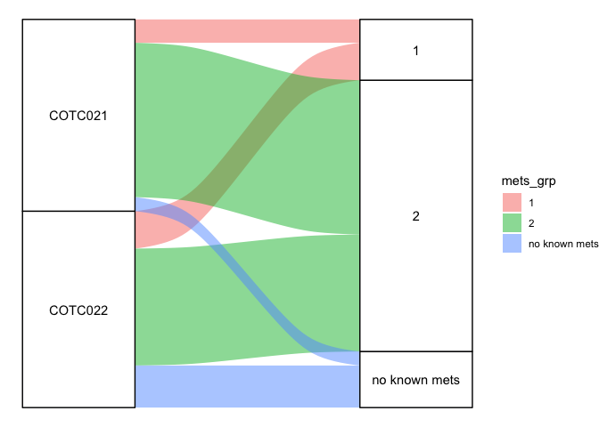

``` r
print(table(data.frame(Site = mm$Trial, mets_grp = mm$Cluster)))
```

    ##          mets_grp
    ## Site       1  2 no known mets
    ##   COTC021  5 33             3
    ##   COTC022  8 25             9

``` r
print(chisq.test(table(data.frame(Site = mm$Trial, mets_grp = mm$Cluster))))
```

    ## 
    ##  Pearson's Chi-squared test
    ## 
    ## data:  table(data.frame(Site = mm$Trial, mets_grp = mm$Cluster))
    ## X-squared = 4.7844, df = 2, p-value = 0.09143

``` r
style_list <- list(cell_borders(sides = "top",color = "grey"))
gm_table <- 
 him_dat %>% 
  mmtable(cells = value) +
  header_left(mets_grp) +
  header_top(Site) +
  header_format(Site, scope = "table", style = style_list)
print(gm_table)
```

<style>#vvrkrphuyh table {
font-family: system-ui, 'Segoe UI', Roboto, Helvetica, Arial, sans-serif, 'Apple Color Emoji', 'Segoe UI Emoji', 'Segoe UI Symbol', 'Noto Color Emoji';
-webkit-font-smoothing: antialiased;
-moz-osx-font-smoothing: grayscale;
}
#vvrkrphuyh thead, #vvrkrphuyh tbody, #vvrkrphuyh tfoot, #vvrkrphuyh tr, #vvrkrphuyh td, #vvrkrphuyh th {
border-style: none;
}
#vvrkrphuyh p {
margin: 0;
padding: 0;
}
#vvrkrphuyh .gt_table {
display: table;
border-collapse: collapse;
line-height: normal;
margin-left: auto;
margin-right: auto;
color: #333333;
font-size: 16px;
font-weight: normal;
font-style: normal;
background-color: #FFFFFF;
width: auto;
border-top-style: solid;
border-top-width: 2px;
border-top-color: #A8A8A8;
border-right-style: none;
border-right-width: 2px;
border-right-color: #D3D3D3;
border-bottom-style: solid;
border-bottom-width: 2px;
border-bottom-color: #A8A8A8;
border-left-style: none;
border-left-width: 2px;
border-left-color: #D3D3D3;
}
#vvrkrphuyh .gt_caption {
padding-top: 4px;
padding-bottom: 4px;
}
#vvrkrphuyh .gt_title {
color: #333333;
font-size: 125%;
font-weight: initial;
padding-top: 4px;
padding-bottom: 4px;
padding-left: 5px;
padding-right: 5px;
border-bottom-color: #FFFFFF;
border-bottom-width: 0;
}
#vvrkrphuyh .gt_subtitle {
color: #333333;
font-size: 85%;
font-weight: initial;
padding-top: 3px;
padding-bottom: 5px;
padding-left: 5px;
padding-right: 5px;
border-top-color: #FFFFFF;
border-top-width: 0;
}
#vvrkrphuyh .gt_heading {
background-color: #FFFFFF;
text-align: center;
border-bottom-color: #FFFFFF;
border-left-style: none;
border-left-width: 1px;
border-left-color: #D3D3D3;
border-right-style: none;
border-right-width: 1px;
border-right-color: #D3D3D3;
}
#vvrkrphuyh .gt_bottom_border {
border-bottom-style: solid;
border-bottom-width: 2px;
border-bottom-color: #D3D3D3;
}
#vvrkrphuyh .gt_col_headings {
border-top-style: solid;
border-top-width: 2px;
border-top-color: #D3D3D3;
border-bottom-style: solid;
border-bottom-width: 2px;
border-bottom-color: #D3D3D3;
border-left-style: none;
border-left-width: 1px;
border-left-color: #D3D3D3;
border-right-style: none;
border-right-width: 1px;
border-right-color: #D3D3D3;
}
#vvrkrphuyh .gt_col_heading {
color: #333333;
background-color: #FFFFFF;
font-size: 100%;
font-weight: normal;
text-transform: inherit;
border-left-style: none;
border-left-width: 1px;
border-left-color: #D3D3D3;
border-right-style: none;
border-right-width: 1px;
border-right-color: #D3D3D3;
vertical-align: bottom;
padding-top: 5px;
padding-bottom: 6px;
padding-left: 5px;
padding-right: 5px;
overflow-x: hidden;
}
#vvrkrphuyh .gt_column_spanner_outer {
color: #333333;
background-color: #FFFFFF;
font-size: 100%;
font-weight: normal;
text-transform: inherit;
padding-top: 0;
padding-bottom: 0;
padding-left: 4px;
padding-right: 4px;
}
#vvrkrphuyh .gt_column_spanner_outer:first-child {
padding-left: 0;
}
#vvrkrphuyh .gt_column_spanner_outer:last-child {
padding-right: 0;
}
#vvrkrphuyh .gt_column_spanner {
border-bottom-style: solid;
border-bottom-width: 2px;
border-bottom-color: #D3D3D3;
vertical-align: bottom;
padding-top: 5px;
padding-bottom: 5px;
overflow-x: hidden;
display: inline-block;
width: 100%;
}
#vvrkrphuyh .gt_spanner_row {
border-bottom-style: hidden;
}
#vvrkrphuyh .gt_group_heading {
padding-top: 8px;
padding-bottom: 8px;
padding-left: 5px;
padding-right: 5px;
color: #333333;
background-color: #FFFFFF;
font-size: 100%;
font-weight: initial;
text-transform: inherit;
border-top-style: solid;
border-top-width: 2px;
border-top-color: #D3D3D3;
border-bottom-style: solid;
border-bottom-width: 2px;
border-bottom-color: #D3D3D3;
border-left-style: none;
border-left-width: 1px;
border-left-color: #D3D3D3;
border-right-style: none;
border-right-width: 1px;
border-right-color: #D3D3D3;
vertical-align: middle;
text-align: left;
}
#vvrkrphuyh .gt_empty_group_heading {
padding: 0.5px;
color: #333333;
background-color: #FFFFFF;
font-size: 100%;
font-weight: initial;
border-top-style: solid;
border-top-width: 2px;
border-top-color: #D3D3D3;
border-bottom-style: solid;
border-bottom-width: 2px;
border-bottom-color: #D3D3D3;
vertical-align: middle;
}
#vvrkrphuyh .gt_from_md > :first-child {
margin-top: 0;
}
#vvrkrphuyh .gt_from_md > :last-child {
margin-bottom: 0;
}
#vvrkrphuyh .gt_row {
padding-top: 8px;
padding-bottom: 8px;
padding-left: 5px;
padding-right: 5px;
margin: 10px;
border-top-style: solid;
border-top-width: 1px;
border-top-color: #D3D3D3;
border-left-style: none;
border-left-width: 1px;
border-left-color: #D3D3D3;
border-right-style: none;
border-right-width: 1px;
border-right-color: #D3D3D3;
vertical-align: middle;
overflow-x: hidden;
}
#vvrkrphuyh .gt_stub {
color: #333333;
background-color: #FFFFFF;
font-size: 100%;
font-weight: initial;
text-transform: inherit;
border-right-style: solid;
border-right-width: 2px;
border-right-color: #D3D3D3;
padding-left: 5px;
padding-right: 5px;
}
#vvrkrphuyh .gt_stub_row_group {
color: #333333;
background-color: #FFFFFF;
font-size: 100%;
font-weight: initial;
text-transform: inherit;
border-right-style: solid;
border-right-width: 2px;
border-right-color: #D3D3D3;
padding-left: 5px;
padding-right: 5px;
vertical-align: top;
}
#vvrkrphuyh .gt_row_group_first td {
border-top-width: 2px;
}
#vvrkrphuyh .gt_row_group_first th {
border-top-width: 2px;
}
#vvrkrphuyh .gt_summary_row {
color: #333333;
background-color: #FFFFFF;
text-transform: inherit;
padding-top: 8px;
padding-bottom: 8px;
padding-left: 5px;
padding-right: 5px;
}
#vvrkrphuyh .gt_first_summary_row {
border-top-style: solid;
border-top-color: #D3D3D3;
}
#vvrkrphuyh .gt_first_summary_row.thick {
border-top-width: 2px;
}
#vvrkrphuyh .gt_last_summary_row {
padding-top: 8px;
padding-bottom: 8px;
padding-left: 5px;
padding-right: 5px;
border-bottom-style: solid;
border-bottom-width: 2px;
border-bottom-color: #D3D3D3;
}
#vvrkrphuyh .gt_grand_summary_row {
color: #333333;
background-color: #FFFFFF;
text-transform: inherit;
padding-top: 8px;
padding-bottom: 8px;
padding-left: 5px;
padding-right: 5px;
}
#vvrkrphuyh .gt_first_grand_summary_row {
padding-top: 8px;
padding-bottom: 8px;
padding-left: 5px;
padding-right: 5px;
border-top-style: double;
border-top-width: 6px;
border-top-color: #D3D3D3;
}
#vvrkrphuyh .gt_last_grand_summary_row_top {
padding-top: 8px;
padding-bottom: 8px;
padding-left: 5px;
padding-right: 5px;
border-bottom-style: double;
border-bottom-width: 6px;
border-bottom-color: #D3D3D3;
}
#vvrkrphuyh .gt_striped {
background-color: rgba(128, 128, 128, 0.05);
}
#vvrkrphuyh .gt_table_body {
border-top-style: solid;
border-top-width: 2px;
border-top-color: #D3D3D3;
border-bottom-style: solid;
border-bottom-width: 2px;
border-bottom-color: #D3D3D3;
}
#vvrkrphuyh .gt_footnotes {
color: #333333;
background-color: #FFFFFF;
border-bottom-style: none;
border-bottom-width: 2px;
border-bottom-color: #D3D3D3;
border-left-style: none;
border-left-width: 2px;
border-left-color: #D3D3D3;
border-right-style: none;
border-right-width: 2px;
border-right-color: #D3D3D3;
}
#vvrkrphuyh .gt_footnote {
margin: 0px;
font-size: 90%;
padding-top: 4px;
padding-bottom: 4px;
padding-left: 5px;
padding-right: 5px;
}
#vvrkrphuyh .gt_sourcenotes {
color: #333333;
background-color: #FFFFFF;
border-bottom-style: none;
border-bottom-width: 2px;
border-bottom-color: #D3D3D3;
border-left-style: none;
border-left-width: 2px;
border-left-color: #D3D3D3;
border-right-style: none;
border-right-width: 2px;
border-right-color: #D3D3D3;
}
#vvrkrphuyh .gt_sourcenote {
font-size: 90%;
padding-top: 4px;
padding-bottom: 4px;
padding-left: 5px;
padding-right: 5px;
}
#vvrkrphuyh .gt_left {
text-align: left;
}
#vvrkrphuyh .gt_center {
text-align: center;
}
#vvrkrphuyh .gt_right {
text-align: right;
font-variant-numeric: tabular-nums;
}
#vvrkrphuyh .gt_font_normal {
font-weight: normal;
}
#vvrkrphuyh .gt_font_bold {
font-weight: bold;
}
#vvrkrphuyh .gt_font_italic {
font-style: italic;
}
#vvrkrphuyh .gt_super {
font-size: 65%;
}
#vvrkrphuyh .gt_footnote_marks {
font-size: 75%;
vertical-align: 0.4em;
position: initial;
}
#vvrkrphuyh .gt_asterisk {
font-size: 100%;
vertical-align: 0;
}
#vvrkrphuyh .gt_indent_1 {
text-indent: 5px;
}
#vvrkrphuyh .gt_indent_2 {
text-indent: 10px;
}
#vvrkrphuyh .gt_indent_3 {
text-indent: 15px;
}
#vvrkrphuyh .gt_indent_4 {
text-indent: 20px;
}
#vvrkrphuyh .gt_indent_5 {
text-indent: 25px;
}
</style>
<table class="gt_table" data-quarto-disable-processing="false" data-quarto-bootstrap="false">
<tbody class="gt_table_body">
<tr>
<td headers class="gt_row gt_left" style="background-color: #FFFFFF; color: #000000; font-size: 12px;">
</td>
<td headers class="gt_row gt_left" style="background-color: #FFFFFF; color: #000000; font-size: 12px; text-align: right; font-weight: bold; border-top-width: 1px; border-top-style: solid; border-top-color: grey;">
COTC021
</td>
<td headers class="gt_row gt_left" style="background-color: #FFFFFF; color: #000000; font-size: 12px; text-align: right; font-weight: bold; border-top-width: 1px; border-top-style: solid; border-top-color: grey;">
COTC022
</td>
</tr>
<tr>
<td headers class="gt_row gt_left" style="background-color: #FFFFFF; color: #000000; font-size: 12px; font-weight: bold;">
1
</td>
<td headers class="gt_row gt_left" style="background-color: #FFFFFF; color: #000000; font-size: 12px; text-align: right; border-top-width: 1px; border-top-style: solid; border-top-color: grey;">
5
</td>
<td headers class="gt_row gt_left" style="background-color: #FFFFFF; color: #000000; font-size: 12px; text-align: right; border-top-width: 1px; border-top-style: solid; border-top-color: grey;">
8
</td>
</tr>
<tr>
<td headers class="gt_row gt_left" style="background-color: #FFFFFF; color: #000000; font-size: 12px; font-weight: bold;">
2
</td>
<td headers class="gt_row gt_left" style="background-color: #FFFFFF; color: #000000; font-size: 12px; text-align: right; border-top-width: 1px; border-top-style: solid; border-top-color: grey;">
33
</td>
<td headers class="gt_row gt_left" style="background-color: #FFFFFF; color: #000000; font-size: 12px; text-align: right; border-top-width: 1px; border-top-style: solid; border-top-color: grey;">
25
</td>
</tr>
<tr>
<td headers class="gt_row gt_left" style="background-color: #FFFFFF; color: #000000; font-size: 12px; font-weight: bold;">
no known mets
</td>
<td headers class="gt_row gt_left" style="background-color: #FFFFFF; color: #000000; font-size: 12px; text-align: right; border-top-width: 1px; border-top-style: solid; border-top-color: grey;">
3
</td>
<td headers class="gt_row gt_left" style="background-color: #FFFFFF; color: #000000; font-size: 12px; text-align: right; border-top-width: 1px; border-top-style: solid; border-top-color: grey;">
9
</td>
</tr>
</tbody>
</table>

``` r
pdf("~/Dog/mets_Trial_arm.pdf")
print(gm_table)
```

<style>#qjcptgvtiv table {
font-family: system-ui, 'Segoe UI', Roboto, Helvetica, Arial, sans-serif, 'Apple Color Emoji', 'Segoe UI Emoji', 'Segoe UI Symbol', 'Noto Color Emoji';
-webkit-font-smoothing: antialiased;
-moz-osx-font-smoothing: grayscale;
}
#qjcptgvtiv thead, #qjcptgvtiv tbody, #qjcptgvtiv tfoot, #qjcptgvtiv tr, #qjcptgvtiv td, #qjcptgvtiv th {
border-style: none;
}
#qjcptgvtiv p {
margin: 0;
padding: 0;
}
#qjcptgvtiv .gt_table {
display: table;
border-collapse: collapse;
line-height: normal;
margin-left: auto;
margin-right: auto;
color: #333333;
font-size: 16px;
font-weight: normal;
font-style: normal;
background-color: #FFFFFF;
width: auto;
border-top-style: solid;
border-top-width: 2px;
border-top-color: #A8A8A8;
border-right-style: none;
border-right-width: 2px;
border-right-color: #D3D3D3;
border-bottom-style: solid;
border-bottom-width: 2px;
border-bottom-color: #A8A8A8;
border-left-style: none;
border-left-width: 2px;
border-left-color: #D3D3D3;
}
#qjcptgvtiv .gt_caption {
padding-top: 4px;
padding-bottom: 4px;
}
#qjcptgvtiv .gt_title {
color: #333333;
font-size: 125%;
font-weight: initial;
padding-top: 4px;
padding-bottom: 4px;
padding-left: 5px;
padding-right: 5px;
border-bottom-color: #FFFFFF;
border-bottom-width: 0;
}
#qjcptgvtiv .gt_subtitle {
color: #333333;
font-size: 85%;
font-weight: initial;
padding-top: 3px;
padding-bottom: 5px;
padding-left: 5px;
padding-right: 5px;
border-top-color: #FFFFFF;
border-top-width: 0;
}
#qjcptgvtiv .gt_heading {
background-color: #FFFFFF;
text-align: center;
border-bottom-color: #FFFFFF;
border-left-style: none;
border-left-width: 1px;
border-left-color: #D3D3D3;
border-right-style: none;
border-right-width: 1px;
border-right-color: #D3D3D3;
}
#qjcptgvtiv .gt_bottom_border {
border-bottom-style: solid;
border-bottom-width: 2px;
border-bottom-color: #D3D3D3;
}
#qjcptgvtiv .gt_col_headings {
border-top-style: solid;
border-top-width: 2px;
border-top-color: #D3D3D3;
border-bottom-style: solid;
border-bottom-width: 2px;
border-bottom-color: #D3D3D3;
border-left-style: none;
border-left-width: 1px;
border-left-color: #D3D3D3;
border-right-style: none;
border-right-width: 1px;
border-right-color: #D3D3D3;
}
#qjcptgvtiv .gt_col_heading {
color: #333333;
background-color: #FFFFFF;
font-size: 100%;
font-weight: normal;
text-transform: inherit;
border-left-style: none;
border-left-width: 1px;
border-left-color: #D3D3D3;
border-right-style: none;
border-right-width: 1px;
border-right-color: #D3D3D3;
vertical-align: bottom;
padding-top: 5px;
padding-bottom: 6px;
padding-left: 5px;
padding-right: 5px;
overflow-x: hidden;
}
#qjcptgvtiv .gt_column_spanner_outer {
color: #333333;
background-color: #FFFFFF;
font-size: 100%;
font-weight: normal;
text-transform: inherit;
padding-top: 0;
padding-bottom: 0;
padding-left: 4px;
padding-right: 4px;
}
#qjcptgvtiv .gt_column_spanner_outer:first-child {
padding-left: 0;
}
#qjcptgvtiv .gt_column_spanner_outer:last-child {
padding-right: 0;
}
#qjcptgvtiv .gt_column_spanner {
border-bottom-style: solid;
border-bottom-width: 2px;
border-bottom-color: #D3D3D3;
vertical-align: bottom;
padding-top: 5px;
padding-bottom: 5px;
overflow-x: hidden;
display: inline-block;
width: 100%;
}
#qjcptgvtiv .gt_spanner_row {
border-bottom-style: hidden;
}
#qjcptgvtiv .gt_group_heading {
padding-top: 8px;
padding-bottom: 8px;
padding-left: 5px;
padding-right: 5px;
color: #333333;
background-color: #FFFFFF;
font-size: 100%;
font-weight: initial;
text-transform: inherit;
border-top-style: solid;
border-top-width: 2px;
border-top-color: #D3D3D3;
border-bottom-style: solid;
border-bottom-width: 2px;
border-bottom-color: #D3D3D3;
border-left-style: none;
border-left-width: 1px;
border-left-color: #D3D3D3;
border-right-style: none;
border-right-width: 1px;
border-right-color: #D3D3D3;
vertical-align: middle;
text-align: left;
}
#qjcptgvtiv .gt_empty_group_heading {
padding: 0.5px;
color: #333333;
background-color: #FFFFFF;
font-size: 100%;
font-weight: initial;
border-top-style: solid;
border-top-width: 2px;
border-top-color: #D3D3D3;
border-bottom-style: solid;
border-bottom-width: 2px;
border-bottom-color: #D3D3D3;
vertical-align: middle;
}
#qjcptgvtiv .gt_from_md > :first-child {
margin-top: 0;
}
#qjcptgvtiv .gt_from_md > :last-child {
margin-bottom: 0;
}
#qjcptgvtiv .gt_row {
padding-top: 8px;
padding-bottom: 8px;
padding-left: 5px;
padding-right: 5px;
margin: 10px;
border-top-style: solid;
border-top-width: 1px;
border-top-color: #D3D3D3;
border-left-style: none;
border-left-width: 1px;
border-left-color: #D3D3D3;
border-right-style: none;
border-right-width: 1px;
border-right-color: #D3D3D3;
vertical-align: middle;
overflow-x: hidden;
}
#qjcptgvtiv .gt_stub {
color: #333333;
background-color: #FFFFFF;
font-size: 100%;
font-weight: initial;
text-transform: inherit;
border-right-style: solid;
border-right-width: 2px;
border-right-color: #D3D3D3;
padding-left: 5px;
padding-right: 5px;
}
#qjcptgvtiv .gt_stub_row_group {
color: #333333;
background-color: #FFFFFF;
font-size: 100%;
font-weight: initial;
text-transform: inherit;
border-right-style: solid;
border-right-width: 2px;
border-right-color: #D3D3D3;
padding-left: 5px;
padding-right: 5px;
vertical-align: top;
}
#qjcptgvtiv .gt_row_group_first td {
border-top-width: 2px;
}
#qjcptgvtiv .gt_row_group_first th {
border-top-width: 2px;
}
#qjcptgvtiv .gt_summary_row {
color: #333333;
background-color: #FFFFFF;
text-transform: inherit;
padding-top: 8px;
padding-bottom: 8px;
padding-left: 5px;
padding-right: 5px;
}
#qjcptgvtiv .gt_first_summary_row {
border-top-style: solid;
border-top-color: #D3D3D3;
}
#qjcptgvtiv .gt_first_summary_row.thick {
border-top-width: 2px;
}
#qjcptgvtiv .gt_last_summary_row {
padding-top: 8px;
padding-bottom: 8px;
padding-left: 5px;
padding-right: 5px;
border-bottom-style: solid;
border-bottom-width: 2px;
border-bottom-color: #D3D3D3;
}
#qjcptgvtiv .gt_grand_summary_row {
color: #333333;
background-color: #FFFFFF;
text-transform: inherit;
padding-top: 8px;
padding-bottom: 8px;
padding-left: 5px;
padding-right: 5px;
}
#qjcptgvtiv .gt_first_grand_summary_row {
padding-top: 8px;
padding-bottom: 8px;
padding-left: 5px;
padding-right: 5px;
border-top-style: double;
border-top-width: 6px;
border-top-color: #D3D3D3;
}
#qjcptgvtiv .gt_last_grand_summary_row_top {
padding-top: 8px;
padding-bottom: 8px;
padding-left: 5px;
padding-right: 5px;
border-bottom-style: double;
border-bottom-width: 6px;
border-bottom-color: #D3D3D3;
}
#qjcptgvtiv .gt_striped {
background-color: rgba(128, 128, 128, 0.05);
}
#qjcptgvtiv .gt_table_body {
border-top-style: solid;
border-top-width: 2px;
border-top-color: #D3D3D3;
border-bottom-style: solid;
border-bottom-width: 2px;
border-bottom-color: #D3D3D3;
}
#qjcptgvtiv .gt_footnotes {
color: #333333;
background-color: #FFFFFF;
border-bottom-style: none;
border-bottom-width: 2px;
border-bottom-color: #D3D3D3;
border-left-style: none;
border-left-width: 2px;
border-left-color: #D3D3D3;
border-right-style: none;
border-right-width: 2px;
border-right-color: #D3D3D3;
}
#qjcptgvtiv .gt_footnote {
margin: 0px;
font-size: 90%;
padding-top: 4px;
padding-bottom: 4px;
padding-left: 5px;
padding-right: 5px;
}
#qjcptgvtiv .gt_sourcenotes {
color: #333333;
background-color: #FFFFFF;
border-bottom-style: none;
border-bottom-width: 2px;
border-bottom-color: #D3D3D3;
border-left-style: none;
border-left-width: 2px;
border-left-color: #D3D3D3;
border-right-style: none;
border-right-width: 2px;
border-right-color: #D3D3D3;
}
#qjcptgvtiv .gt_sourcenote {
font-size: 90%;
padding-top: 4px;
padding-bottom: 4px;
padding-left: 5px;
padding-right: 5px;
}
#qjcptgvtiv .gt_left {
text-align: left;
}
#qjcptgvtiv .gt_center {
text-align: center;
}
#qjcptgvtiv .gt_right {
text-align: right;
font-variant-numeric: tabular-nums;
}
#qjcptgvtiv .gt_font_normal {
font-weight: normal;
}
#qjcptgvtiv .gt_font_bold {
font-weight: bold;
}
#qjcptgvtiv .gt_font_italic {
font-style: italic;
}
#qjcptgvtiv .gt_super {
font-size: 65%;
}
#qjcptgvtiv .gt_footnote_marks {
font-size: 75%;
vertical-align: 0.4em;
position: initial;
}
#qjcptgvtiv .gt_asterisk {
font-size: 100%;
vertical-align: 0;
}
#qjcptgvtiv .gt_indent_1 {
text-indent: 5px;
}
#qjcptgvtiv .gt_indent_2 {
text-indent: 10px;
}
#qjcptgvtiv .gt_indent_3 {
text-indent: 15px;
}
#qjcptgvtiv .gt_indent_4 {
text-indent: 20px;
}
#qjcptgvtiv .gt_indent_5 {
text-indent: 25px;
}
</style>
<table class="gt_table" data-quarto-disable-processing="false" data-quarto-bootstrap="false">
<tbody class="gt_table_body">
<tr>
<td headers class="gt_row gt_left" style="background-color: #FFFFFF; color: #000000; font-size: 12px;">
</td>
<td headers class="gt_row gt_left" style="background-color: #FFFFFF; color: #000000; font-size: 12px; text-align: right; font-weight: bold; border-top-width: 1px; border-top-style: solid; border-top-color: grey;">
COTC021
</td>
<td headers class="gt_row gt_left" style="background-color: #FFFFFF; color: #000000; font-size: 12px; text-align: right; font-weight: bold; border-top-width: 1px; border-top-style: solid; border-top-color: grey;">
COTC022
</td>
</tr>
<tr>
<td headers class="gt_row gt_left" style="background-color: #FFFFFF; color: #000000; font-size: 12px; font-weight: bold;">
1
</td>
<td headers class="gt_row gt_left" style="background-color: #FFFFFF; color: #000000; font-size: 12px; text-align: right; border-top-width: 1px; border-top-style: solid; border-top-color: grey;">
5
</td>
<td headers class="gt_row gt_left" style="background-color: #FFFFFF; color: #000000; font-size: 12px; text-align: right; border-top-width: 1px; border-top-style: solid; border-top-color: grey;">
8
</td>
</tr>
<tr>
<td headers class="gt_row gt_left" style="background-color: #FFFFFF; color: #000000; font-size: 12px; font-weight: bold;">
2
</td>
<td headers class="gt_row gt_left" style="background-color: #FFFFFF; color: #000000; font-size: 12px; text-align: right; border-top-width: 1px; border-top-style: solid; border-top-color: grey;">
33
</td>
<td headers class="gt_row gt_left" style="background-color: #FFFFFF; color: #000000; font-size: 12px; text-align: right; border-top-width: 1px; border-top-style: solid; border-top-color: grey;">
25
</td>
</tr>
<tr>
<td headers class="gt_row gt_left" style="background-color: #FFFFFF; color: #000000; font-size: 12px; font-weight: bold;">
no known mets
</td>
<td headers class="gt_row gt_left" style="background-color: #FFFFFF; color: #000000; font-size: 12px; text-align: right; border-top-width: 1px; border-top-style: solid; border-top-color: grey;">
3
</td>
<td headers class="gt_row gt_left" style="background-color: #FFFFFF; color: #000000; font-size: 12px; text-align: right; border-top-width: 1px; border-top-style: solid; border-top-color: grey;">
9
</td>
</tr>
</tbody>
</table>

``` r
dev.off()
```

    ## quartz_off_screen 
    ##                 2

#Cluster-specific differential expression analysis

``` r
library(edgeR)
```

    ## Loading required package: limma

``` r
library(matrixStats)
library(fgsea)
library(tidyverse)
```

    ## Warning: package 'tidyverse' was built under R version 4.1.2

    ## Warning: package 'tibble' was built under R version 4.1.2

    ## Warning: package 'forcats' was built under R version 4.1.2

    ## Warning: package 'lubridate' was built under R version 4.1.2

    ## ── Attaching core tidyverse packages ──────────────────────── tidyverse 2.0.0 ──
    ## ✔ forcats   1.0.0     ✔ tibble    3.2.1
    ## ✔ lubridate 1.9.2

    ## ── Conflicts ────────────────────────────────────────── tidyverse_conflicts() ──
    ## ✖ data.table::between() masks dplyr::between()
    ## ✖ matrixStats::count()  masks dplyr::count()
    ## ✖ rstatix::filter()     masks dplyr::filter(), stats::filter()
    ## ✖ data.table::first()   masks dplyr::first()
    ## ✖ lubridate::hour()     masks data.table::hour()
    ## ✖ lubridate::isoweek()  masks data.table::isoweek()
    ## ✖ dplyr::lag()          masks stats::lag()
    ## ✖ data.table::last()    masks dplyr::last()
    ## ✖ lubridate::mday()     masks data.table::mday()
    ## ✖ lubridate::minute()   masks data.table::minute()
    ## ✖ lubridate::month()    masks data.table::month()
    ## ✖ lubridate::quarter()  masks data.table::quarter()
    ## ✖ lubridate::second()   masks data.table::second()
    ## ✖ MASS::select()        masks rstatix::select(), dplyr::select()
    ## ✖ purrr::transpose()    masks data.table::transpose()
    ## ✖ lubridate::wday()     masks data.table::wday()
    ## ✖ lubridate::week()     masks data.table::week()
    ## ✖ lubridate::yday()     masks data.table::yday()
    ## ✖ lubridate::year()     masks data.table::year()
    ## ℹ Use the conflicted package (<http://conflicted.r-lib.org/>) to force all conflicts to become errors

``` r
library(msigdbr)
```

    ## Warning: package 'msigdbr' was built under R version 4.1.2

``` r
library(clusterProfiler)
```

    ## 
    ## Registered S3 method overwritten by 'ggtree':
    ##   method      from 
    ##   identify.gg ggfun
    ## clusterProfiler v4.0.5  For help: https://yulab-smu.top/biomedical-knowledge-mining-book/
    ## 
    ## If you use clusterProfiler in published research, please cite:
    ## T Wu, E Hu, S Xu, M Chen, P Guo, Z Dai, T Feng, L Zhou, W Tang, L Zhan, X Fu, S Liu, X Bo, and G Yu. clusterProfiler 4.0: A universal enrichment tool for interpreting omics data. The Innovation. 2021, 2(3):100141. doi: 10.1016/j.xinn.2021.100141
    ## 
    ## Attaching package: 'clusterProfiler'
    ## 
    ## The following object is masked from 'package:MASS':
    ## 
    ##     select
    ## 
    ## The following object is masked from 'package:purrr':
    ## 
    ##     simplify
    ## 
    ## The following object is masked from 'package:stats':
    ## 
    ##     filter

``` r
DOG2_Raw_RNA_SEQ_DATA <- read_csv("~/Dog/DOG2_Raw_RNA_SEQ_DATA.csv")
```

    ## Rows: 37952 Columns: 187
    ## ── Column specification ────────────────────────────────────────────────────────
    ## Delimiter: ","
    ## chr   (1): gene_id
    ## dbl (186): 102, 105, 106, 201, 202, 203, 204, 206, 207, 209, 210, 211, 212, ...
    ## 
    ## ℹ Use `spec()` to retrieve the full column specification for this data.
    ## ℹ Specify the column types or set `show_col_types = FALSE` to quiet this message.

``` r
genes <- DOG2_Raw_RNA_SEQ_DATA$gene_id
genes <- sapply(genes, function(x) strsplit(x, split = "_")[[1]][1])
DOG2_Raw_RNA_SEQ_DATA$gene_id <- NULL
common <- intersect(colnames(DOG2_Raw_RNA_SEQ_DATA), as.character(names(cluster)))
clss <- as.character(cluster)
names(clss) <- names(cluster)
groups = clss[common]
groups = c("rest","1")[as.numeric(groups == "1")+1]
counts.DGEList <- DGEList(counts = DOG2_Raw_RNA_SEQ_DATA[,common], genes = genes, group = as.factor(groups))
counts.keep <- filterByExpr(y = counts.DGEList)
counts.DGEList <- counts.DGEList[counts.keep, , keep.lib.sizes = FALSE]
counts.DGEList <- calcNormFactors(counts.DGEList)
counts.DGEList <- estimateDisp(counts.DGEList,design = model.matrix(~groups))
rest_1.DGEExact <- exactTest(counts.DGEList, pair = c("rest","1"))
msigdbr_df <- msigdbr(species = "Homo sapiens", category = "H")
msigdbr_list = split(x = msigdbr_df$gene_symbol, f = msigdbr_df$gs_name)
ranks <- rest_1.DGEExact$table$logFC
names(ranks) <- counts.DGEList$genes$genes
ranks <- sort(ranks, decreasing = T)
gsea_res <- GSEA(geneList = ranks, TERM2GENE = subset(msigdbr_df, select = c("gs_name","gene_symbol")),pvalueCutoff = 1, nPermSimple = 100000)
```

    ## preparing geneSet collections...
    ## GSEA analysis...

    ## Warning in preparePathwaysAndStats(pathways, stats, minSize, maxSize, gseaParam, : There are ties in the preranked stats (0.14% of the list).
    ## The order of those tied genes will be arbitrary, which may produce unexpected results.

    ## Warning in preparePathwaysAndStats(pathways, stats, minSize, maxSize,
    ## gseaParam, : There are duplicate gene names, fgsea may produce unexpected
    ## results.

    ## Warning in fgseaMultilevel(...): For some pathways, in reality P-values are
    ## less than 1e-10. You can set the `eps` argument to zero for better estimation.

    ## leading edge analysis...
    ## done...

``` r
fgseaResTidy_1 <- gsea_res %>%
as_tibble() %>%
arrange(desc(NES))
p1 <- ggplot(fgseaResTidy_1, aes(reorder(ID, NES), NES)) +
geom_col(aes(fill=p.adjust < 0.05)) +
coord_flip() +
labs(x="Pathway", y="Normalized Enrichment Score",title="Hallmark pathways NES from GSEA") + 
  theme_minimal()
print(p1)
```

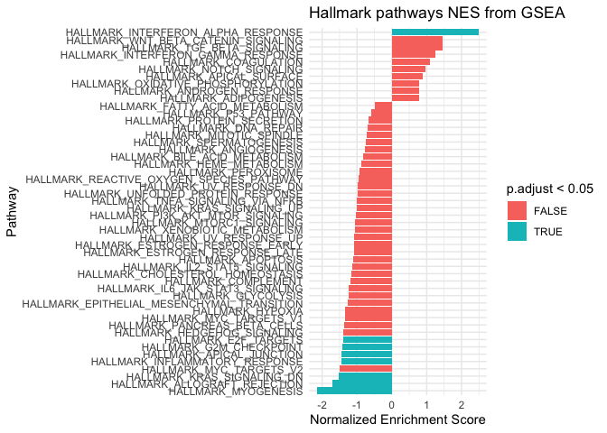

``` r
pdf("~/Dog/revisedVCO_DE_analysis.pdf", width = 8, height = 7)
print(p1)
dev.off()
```

    ## quartz_off_screen 
    ##                 2

#Heat map visualization of top 10 leading edge genes from enriched
pathways in each cluster

``` r
logcounts <- apply(cpm(counts.DGEList,log=TRUE),2,scale)
rownames(logcounts) <- counts.DGEList$genes$genes
ha = columnAnnotation(
    Cluster = as.character(clss[common]),
    col = list("Cluster"= c("1" =  "#CC6677", "2" = "#88CCEE"))
)
core_genes_1 <- strsplit(fgseaResTidy_1$core_enrichment[1],"/")[[1]]
core_genes_1 <- names(sort(sapply(core_genes_1, function(x) which(names(ranks) == x)))[1:10])
gsets_1 <- rep(fgseaResTidy_1$ID[1],10)
core_genes_2 <- Reduce(c, sapply(fgseaResTidy_1$core_enrichment[fgseaResTidy_1$NES < 0 & fgseaResTidy_1$p.adjust < 0.05], function(x) {
  gs <- strsplit(x,"/")[[1]]
  gs <- names(sort(sapply(gs, function(y) which(names(ranks) == y)), decreasing = T)[1:10])
  }))
gsets_2 <- Reduce(c, sapply(fgseaResTidy_1$ID[fgseaResTidy_1$NES < 0 & fgseaResTidy_1$p.adjust < 0.05], function(x) {
  rep(x, 10)
  }))
Heatmap((logcounts[c(core_genes_1,core_genes_2), common]), top_annotation = ha, cluster_rows = T, column_split = as.character(clss[common]), row_split = c(gsets_1, gsets_2), cluster_row_slices = F, cluster_column_slices = T)
```

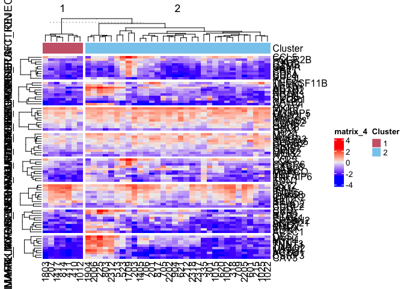

``` r
pdf("~/Dog/vco_enrichment_heatmap.pdf", height = 14, width = 8)
Heatmap((logcounts[c(core_genes_1,core_genes_2), common]), top_annotation = ha, cluster_rows = T, column_split = as.character(clss[common]), row_split = gsub("HALLMARK_","",c(gsets_1, gsets_2)), cluster_row_slices = F, cluster_column_slices = T)
dev.off()
```

    ## quartz_off_screen 
    ##                 2
